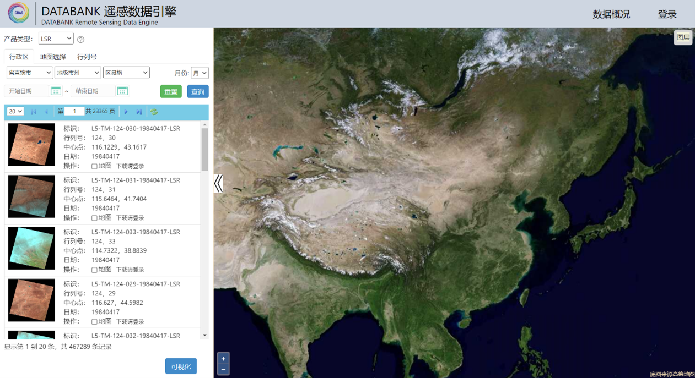
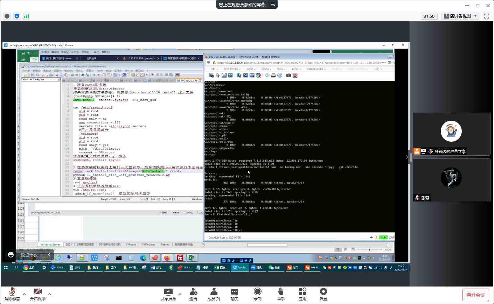

# 应用案例  

## PB级数据存储-CASEarth DataBank遥感数据引擎  

CASEarth DataBank是面向地球大数据科学工程建立的一套具有自主知识产权的数据、计算与服务一体化的时序对地观测数据智能服务平台，能够高效存取多源、多尺度、长时序的卫星影像及其他地球观测数据数据库中的资料并提供足够的运算能力来对这些数据进行处理和分析。  

目前，DATABANK的遥感图像数据集均存储在iharbor中，涉及17个对象存储桶，存储数据量超过1.35PB，元数据约六千万条。Iharbor支持遥感图像的高并发读写，DataBank网站以50GB/S的速度实时在线获取遥感图像数据，并进行可视化渲染。Iharbor对象存储基于稳定的底层架构和高速接口服务于DataBank，进一步助力遥感卫星“大数据”向空间信息和地学知识高效转化，对促进人工智能与遥感信息处理等多学科交叉融合和科技创新，具有重要意义。  

  

## 助力“全球开放科学云”项目国际培训  

2022年9月，一体化云服务平台为“2022 开放科学和可持续发展国际培训班”（2022 International Training Workshop on Open science and SDGs）提供技术支持和培训资源，共制作发放200张1200点资源券，用于购买云主机。培训内容包括：中国科技云一体云解决方案介绍、一体化云服务平台实操演示、对象存储介绍及4种数据访问方式实操演示。在线培训国际用户近百人，用户在线实时创建云主机数十台，培训效果显著。  

  

## EVCloud有效支撑空间环境和航空航天领域的大数据处理  

轻量级、灵活配置、可扩展的EVCloud在计算资源统一管理方面具有优势。**国家空间科学中心**和**中国科学院微小卫星创新研究院**通过EVCloud便捷地完成近几十台服务器部署，实现宿主机、云主机的镜像、网络、硬盘的灵活配置。EVCloud的应用在计算资源自主管理运行、促成科研计算任务上云等方面有了自主性和新的探索。  

  
