# How to use the VPN
Some Service units where the server is located can realize SSH connection only after connecting to the VPN.

## Windows  
### 1 openVPN client   
#### 1.1 Downloading the openVPN Client
Please click the link [Downloading the openVPN client](https://obs.cstcloud.cn/share/obs/cstcloud/OpenVPN-2.5.4-I604-amd64.msi)

#### 1.2 Installing the openVPN Client 
* Click【next】 to proceed to the next step.

* Click【I Agree】to proceed to the next step. 

* Use the default components, and then click【next】 to proceed to the next step. 

* The default directory can be used as the installation directory without modification, 
click 【Install】 to start the installation. 

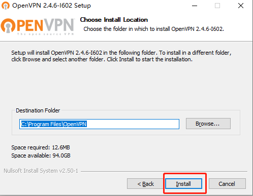

### 2 Configuration file

* After the openVPN client is installed, there are two configuration files which need to be configured before it can be used.
They are: 1. VPN node configuration file  2. CA certificate file

* The configuration file corresponds to the Service unit, that is, **the server in the same Service unit uses the same configuration file, and only needs to be configured once.**  

####  2.1 Downloading the Configuration File   
* The downloading location is shown in Figure 5, click 【Download】 to start the download.

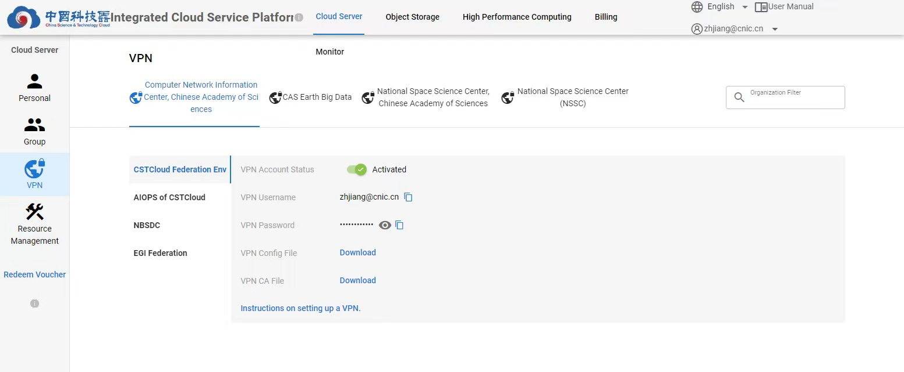

#### 2.2 Moving the Configuration File
* Move the two files just downloaded to the specified save path of configuration file.   
  The default configuration file save path of openVPN is：C:\Program Files\OpenVPN\config, as shown in Figure 6. (If the directory location is modified during the installation process, you need to find the corresponding path by yourself.) 
  

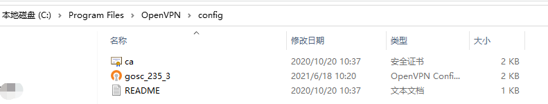

* If you encounter a prompt, "You need to provide administrator privileges to move files", during the copying process, just click 【Continue】.  
  

### 3 Start the VPN connection  

* Double-click the openVPN client icon, if 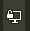 appears in the lower right corner of the taskbar, this indicates that the client is started.

* Right-click , select the corresponding configuration, such as “gosc_235_3”, click【connect】

* Enter username and password according to the prompt, and then click 【OK】. Check “Save password”, and the next time you log in, the password will be remembered to avoid multiple input. **Username and password are available on the configuration file download page.**

* After the connection is successful, the lower right corner of the taskbar will appear:  , this means that the VPN is connected. At this point, SSH connection can be implemented to the server.

## macOS
### 1 Configuration file

* First, download the two configuration files required for the VPN client to function. 
They are: 1. VPN node configuration file  2. CA certificate file 
* The configuration file corresponds to the Service unit, that is, **the server in the same Service unit uses the same configuration file, and only needs to be configured once.**  

####  1.1 Downloading the Configuration File   
* The downloading location is shown in the Figure below, click 【Download】 to start the download. 

#### 1.2 Moving the Configuration File
* Put these two files in the same folder, such as the following location: /Applications/OpenVPN Connect
(Installation directory can be customized.)

* If you encounter a prompt, 'Modifying "OpenVPN" requires an administrator name and password' , during the copying process, please click 【Authenticate】 directly.
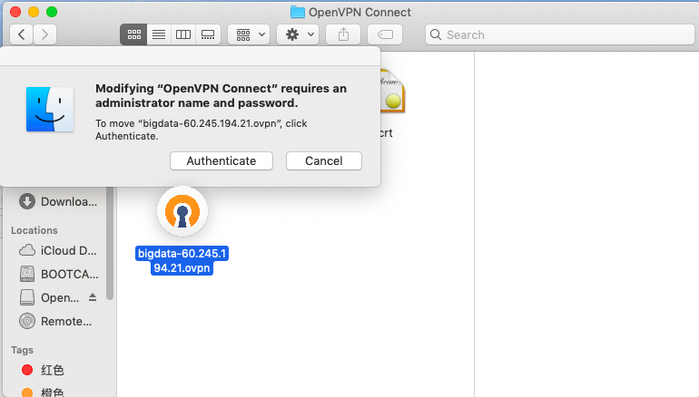

* Enter the username and password on the pop-up page, and click 【Ok】.
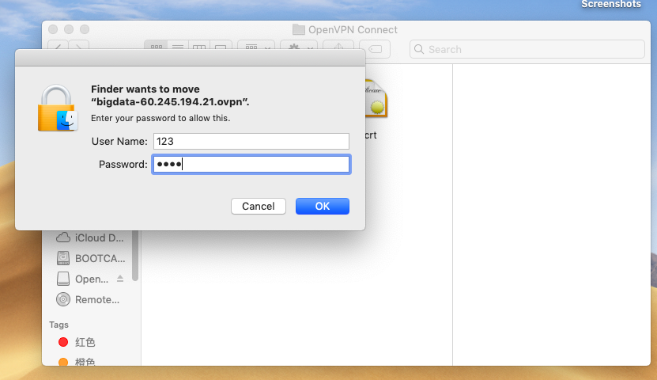

#### 1.3 Trusting the CA certificate file
* Launchpad > Others > Keychain Access.

* Select 【System】 in the left-hand column.
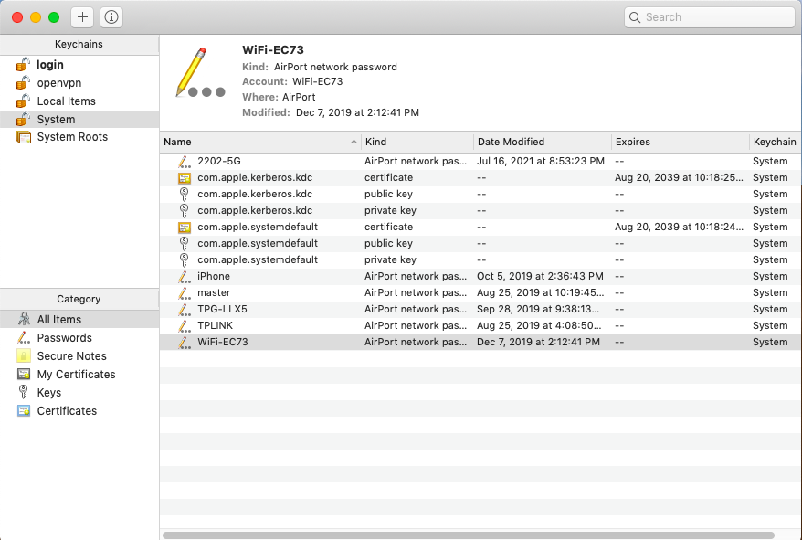

* Import the certificate file into the 【System】 keychain. As shown in the figure below, the CA certificate file is not trusted at this time.
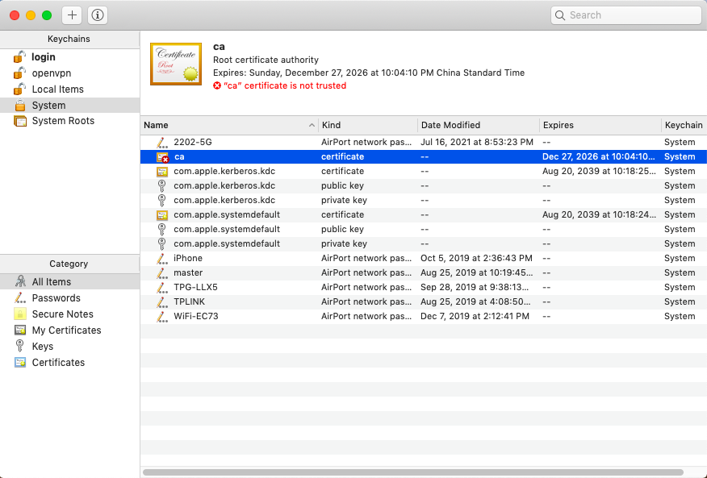

* Double-click the CA certificate file, and then click the triangle button on the left side of 【Trust】 to expand its functions.

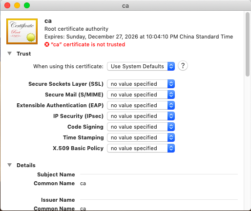

* Change the default option 【Use System Defaults】 of the first item to 【Always Trust】. 
* After the modification, other options will be changed accordingly, and the modification can be completed by closing the page.
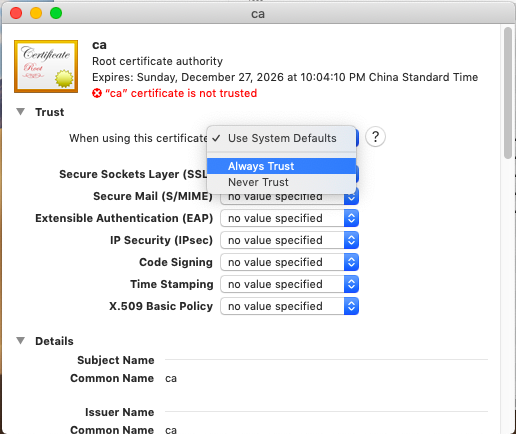
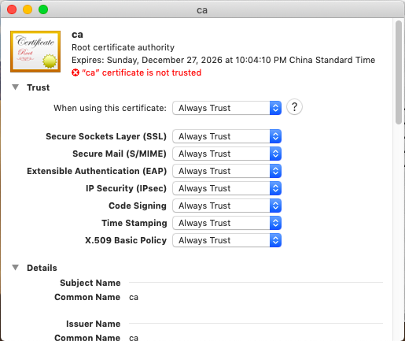

* After the trust configuration is completed, the interface shown in the following figure will be displayed.
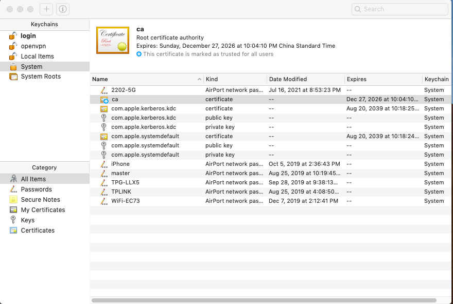

### 2 Install the Tunnelblick and Start the VPN connection
#### 2.1 Downloading the Tunnelblick Client
Please click the link [Downloading the Tunnelblick client](https://tunnelblick.net/release/Latest_Tunnelblick_Stable.dmg)

#### 2.2 Installation and Configuration

* Click the downloaded file will pop up the figure as shown below.
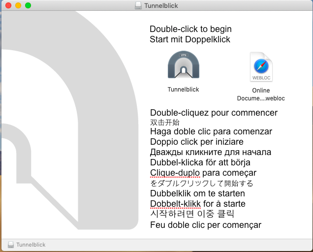

* Follow the instructions on the figure to implement the installation process. 
* After the installation is complete, a prompt message for configuring configuration files will appear, 
and operate as required.

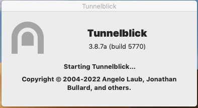

* Or double-click the Tunnelblick client button in the upper right corner of the screen to pop up the configuration page.
* Manually import the VPN node configuration file into the 【Configurations】 column on the left, and select 【Only Me】 on the pop-up page.
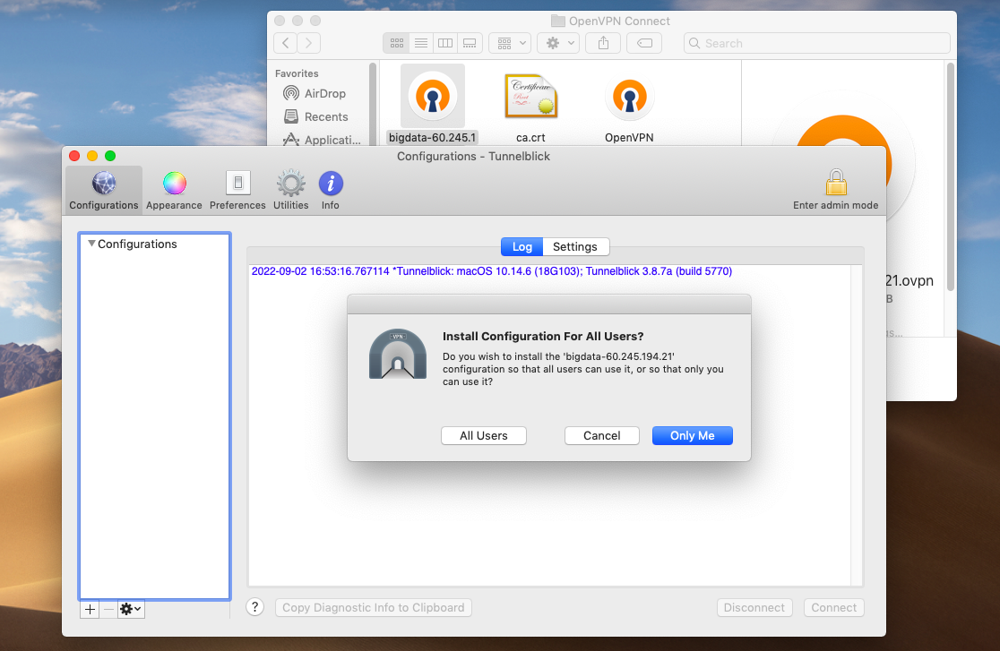

* At this point, the configuration process of the VPN node configuration file is finished.
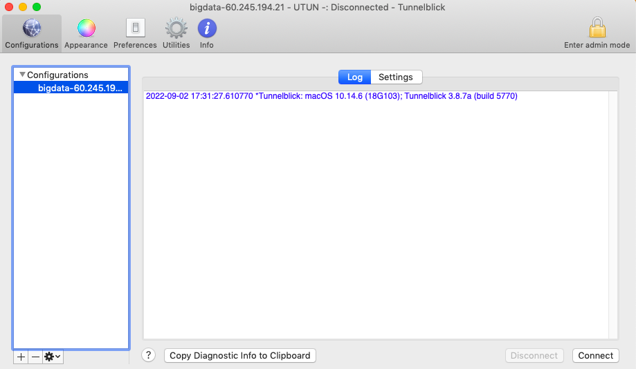

* If there is a warning about the Tunnelblick version, just click 【Ok】.
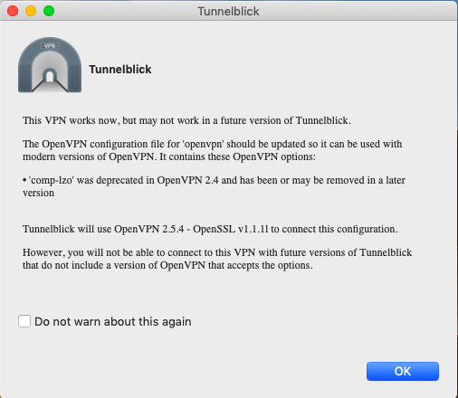

* Then left-click the Tunnelbrick client button in the upper right corner and select the connect option.
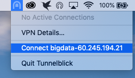

* Enter the user name and password, the 【Security code】 can be ignored temporarily.
(Username and password are available on the download page of the configuration file.)

* If there is a prompt or warning as shown in Figure 27 or 28, you can directly click 【Ok】 to skip.
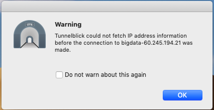
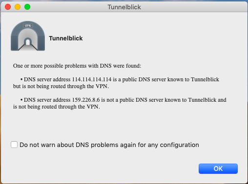

* After the connection is successful, the Tunnelblick button in the upper right corner will turn dark, and a page indicating the connection status will appear when you right-click the button.
* At this point, SSH connection can be implemented to the server.

