# 项目组资源 

* 项目组：是**计算资源**与**人员**的整合，组内资源由所有人员共享。
## 项目组使用  
###  1 新建项目组  
点击按钮，进入[新建项目组页面](https://fed.cstcloud.cn/my/group/create)   
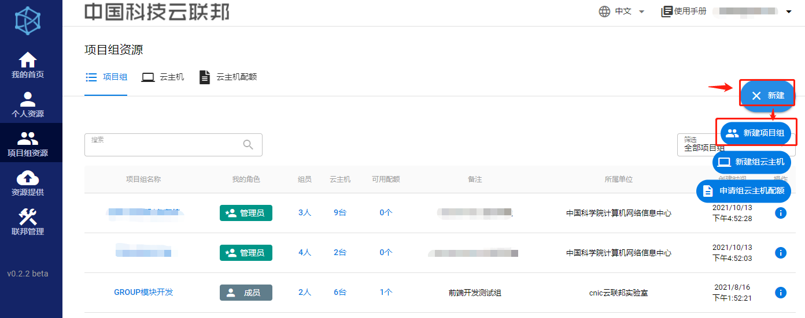   
输入项目组名称、描述，并确认所属单位信息，点击“创建”按钮，新建项目组  
   
成功创建项目组后，页面将跳转到项目组列表页面   
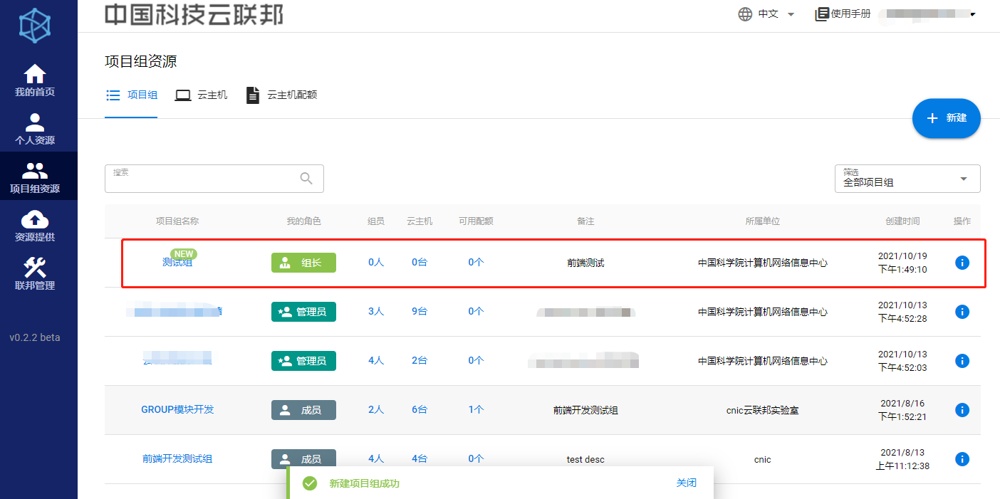   
### 2 项目组详情   
点击项目组名称或项目组详情按钮，跳转至项目组详情页面，展示与该项目组有关的资源、人员信息  
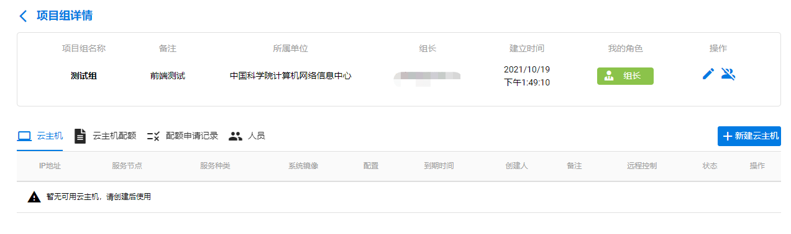   
### 3 解散项目组  
解散项目组需保证组内云主机、云主机配额、配额申请记录、人员等均被删除或移除，组长才能解散项目组  
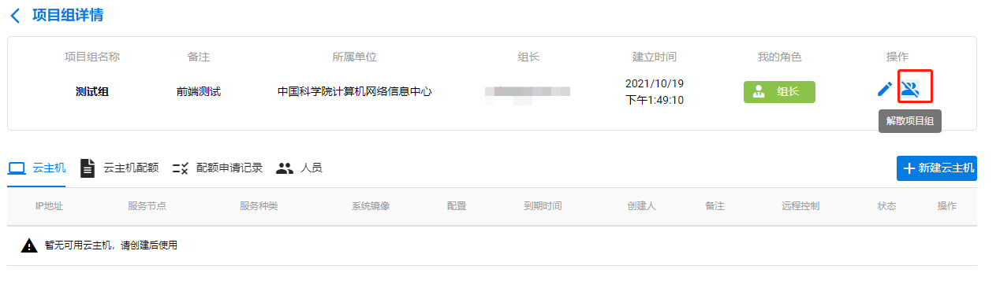   
### 4 项目组云主机列表  
查看所有项目组的云主机列表，在右上角以项目组为单位进行组筛选  
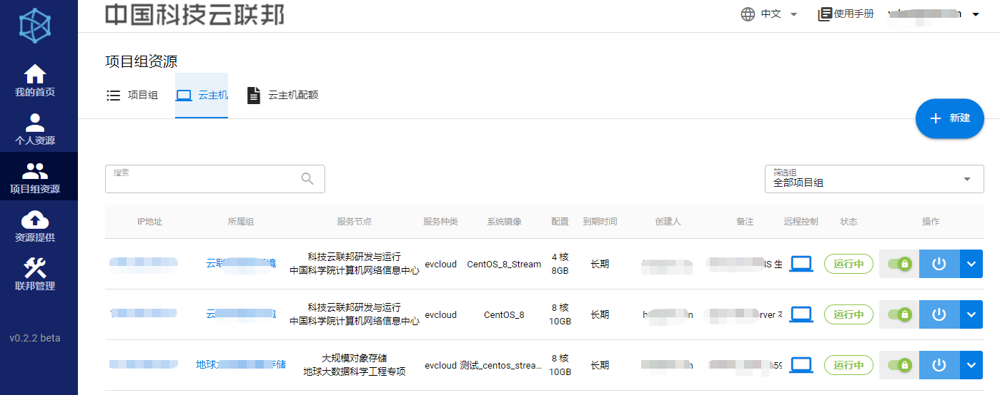   
### 5 项目组云主机配额列表  
查看所有项目组的云主机配额列表，在右上角以项目组为单位进行组筛选  
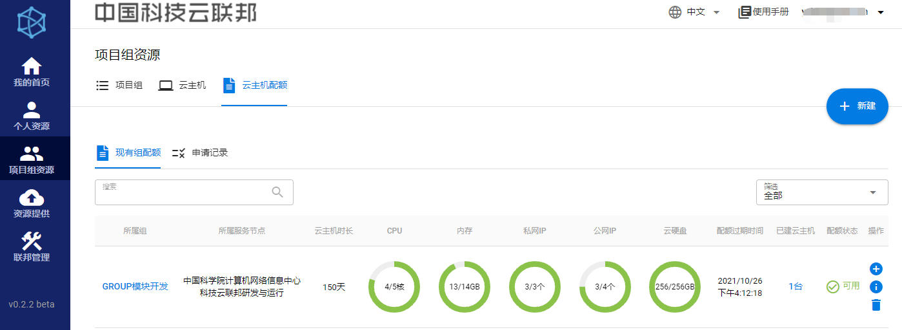   
 
## 云主机资源使用  
使用云主机资源，需先申请组云主机配额，再根据组云主机配额进行资源的创建、使用  
###  组云主机配额  
### 1 组云主机配额介绍  
配额用来控制资源的分配，由组长或管理员提出申请，再由服务节点的管理员审批  
组长和管理员可以利用配额创建云主机  

每一份组云主机配额包含：  

* 服务节点：配额与服务节点绑定。使用每个服务节点的云主机资源前，均需在该节点进行申请对应云主机配额。如需更换服务节点，则必须申请新的云主机配额  
* 云主机时长：利用该配额创建的云主机的可用时长，从云主机创建起计算  
* CPU/内存/私网IP/公网IP/云硬盘：该配额内资源的总额，用尽则配额失效  
* 配额失效时间：该配额的最后可用时间，过期则配额失效  
* 所属组：配额的归属组  

### 2 组云主机配额申请流程  
#### 2.1 进入组云主机配额申请页面  
点击按钮，进入[组云主机配额申请页面](https://fed.cstcloud.cn/my/group/quota/apply)   
   

或者   

先进入**项目组详情页面**，再点击“申请新配额”按钮，进入“组云主机配额申请页面”  
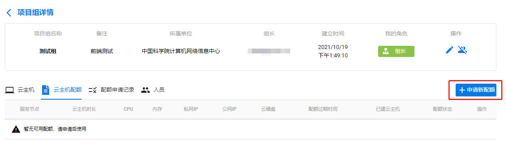   
#### 2.2 选取使用该配额的项目组  
  
#### 2.3 选取目标服务节点  
  
#### 2.4 选取所需资源总额  
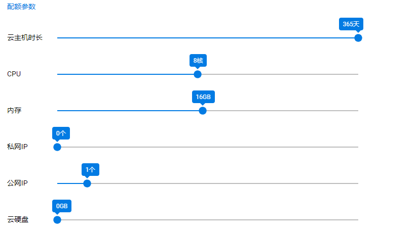  
#### 2.5 填写备注  
  
#### 2.6 检查申请信息，并提交申请   
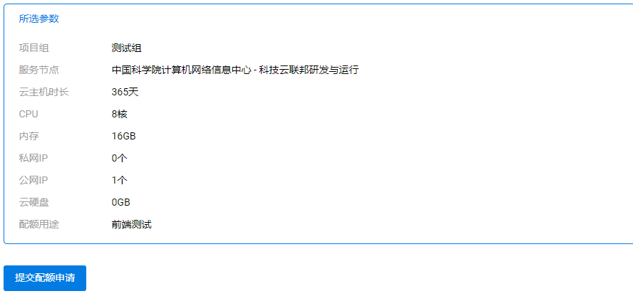  
申请提交后，请等待服务节点的管理员审批  

### 组云主机  
项目组的组配额经审批通过后，组长和管理员可以利用该配额在相应服务节点创建云主机  
### 1 创建组云主机  
#### 1.1 进入新建组云主机页面  
点击按钮，进入[组云主机新建页面](https://fed.cstcloud.cn/my/group/server/deploy)   
   

或者  

先进入**项目组详情页面**，再点击“新建云主机”按钮，进入“组云主机新建页面”  
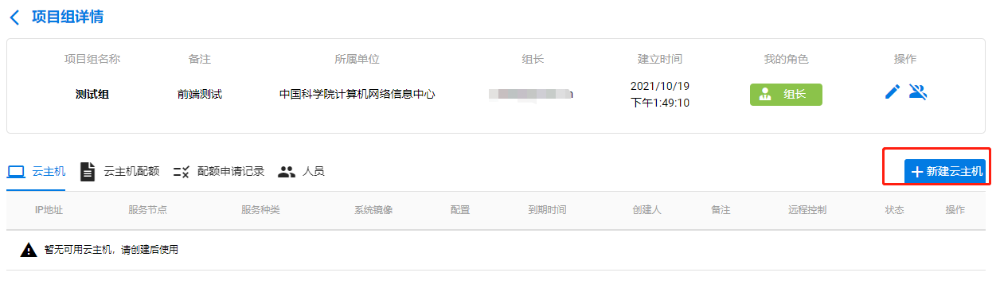   
#### 1.2 选择使用该云主机的项目组  
   
#### 1.3 选择目标服务节点  
   
#### 1.4 选择要使用的云主机配额  
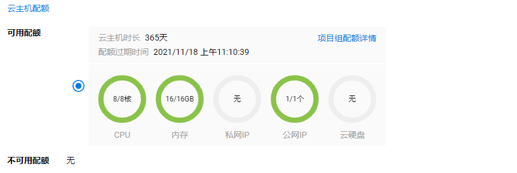   
#### 1.5 选择所需配置，并填写备注  
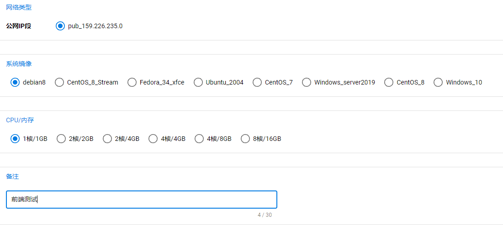   
#### 1.6 检查云主机信息，并提交  
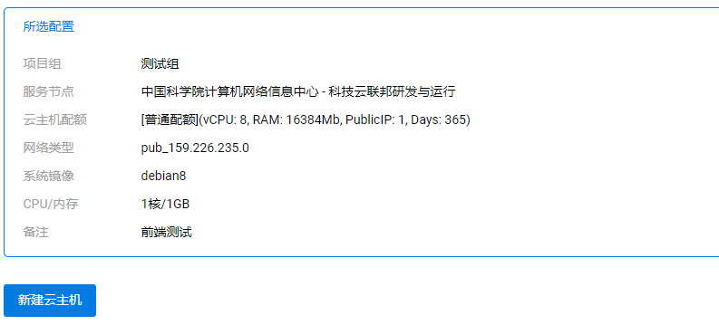   
#### 1.7 成功创建云主机后，页面将跳转到项目组云主机列表页面  
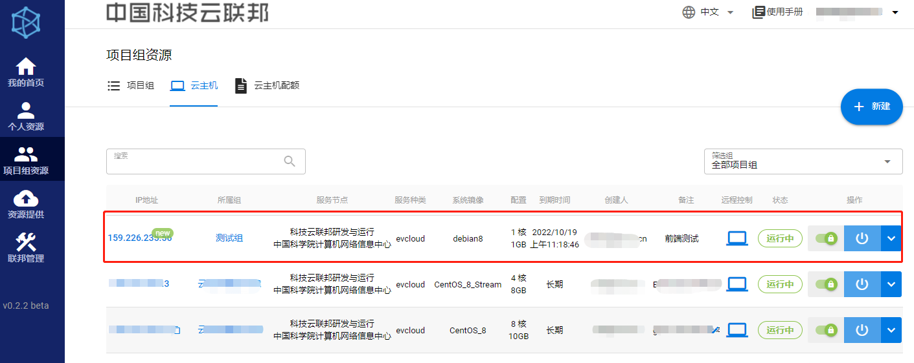   

### 2 使用组云主机  
点击云主机IP地址，或云主机详情按钮，可进入云主机详情页面  
该页面包含该云主机全部信息，例如：操作系统初始用户名、密码，VPN信息，配置信息，组信息，配额信息等  
也可在右上角对云主机进行操作  
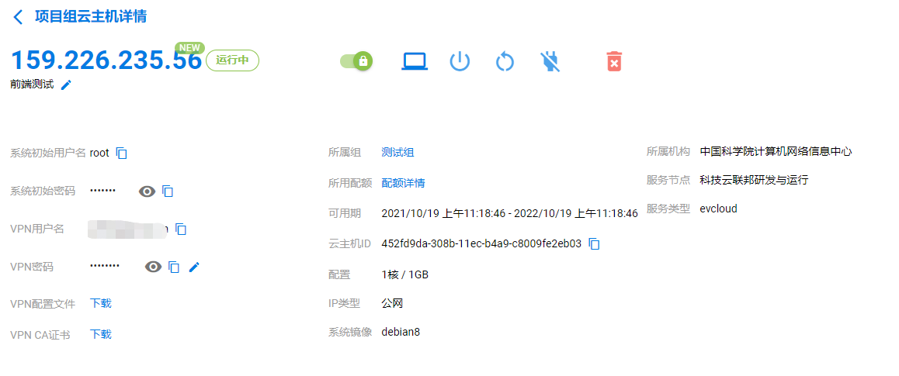  
#### 2.1 云主机操作
* 开机：启动该云主机  
* 关机 ： 关闭该云主机  
* 重启 ： 重启该云主机  
* 断电 ： 对该云主机强制断电  
* 删除 ：删除该云主机  
* 强制删除：在删除云主机不起作用时，可强制删除该云主机  
* 锁定：被锁定的云主机，不能进行开机、关机、重启、断电、删除和强制删除等操作，仅能查看组云主机详情、使用VNC、进行SSH连接  
#### 2.2 VNC远程控制
点击远程控制按钮，可在浏览器内对云主机进行远程控制  
#### 2.4 SSH连接
在[连接VPN](/manual/vpn)后，可使用xshell、bitvise等工具与云主机建立SSH连接  
云主机操作系统的初始用户名和密码可在云主机详情页面内查询  

## 项目组角色与权限  
### 1 组长  
每个项目组只有1名组长，为该组的创建人  

组长权限：   

*  管理组员：添加成员，通过添加科技云通行证账户或发送邀请链接（暂未上线）的方式；移除成员，被移除的成员不再享用项目组内的任何资源；查看所有组员的资源使用情况  
*  分配角色：为成员赋予管理员的角色，或取消其管理员的角色  
*  使用资源：使用云主机、对象存储、高性能计算等资源。如：申请云主机配额；创建云主机；使用组内任何成员创建的云主机  
*  管理资源：管理云主机、对象存储、高性能计算等资源  
*  删除项目组：需先删除项目组内所有云主机、云主机配额、配额申请记录、人员等  
*  组长权限移交（暂未上线）   

### 2 管理员  
每个组允许有多个管理员，只有组长能够赋予成员“管理员”的角色  

管理员权限：   

*  管理组员：添加成员，通过科技云通行证账户或发送链接（暂未上线）的方式；移除成员，被移除的成员不再享用项目组内的任何资源；查看所有组员的资源使用情况  
*  使用资源：使用云主机、对象存储、高性能计算等资源。如：申请云主机配额；创建云主机；使用组内任何成员创建的云主机  
*  管理资源：管理云主机、对象存储、高性能计算等资源   
### 3 组员  
每个组的成员数量不作限制，不具备管理权限  

组员权限：  

*  使用资源：使用云主机、对象存储、高性能计算等资源。如：使用组内任何成员创建的云主机  
## 项目组成员管理  
### 1 新增人员  
先进入**项目组详情页面**，再点击“新增人员”按钮，添加成员  
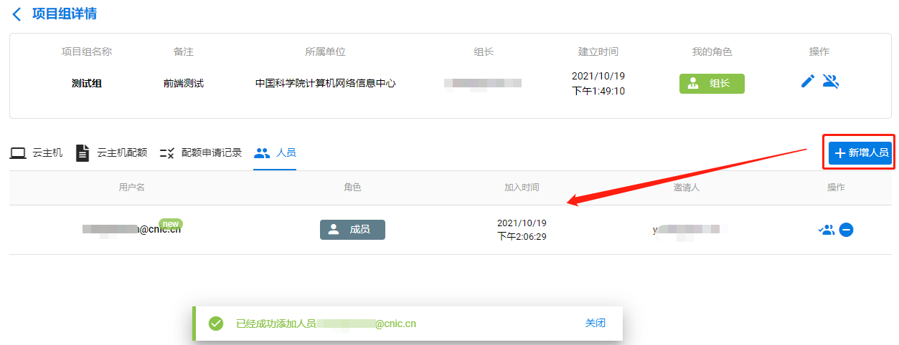   
在“增加人员页面”，输入正确的“科技云通行证”邀请成员进入项目组，可输入多个  
   

### 2 赋予/取消管理员权限  
点击按钮，将组内成员设为“管理员”  
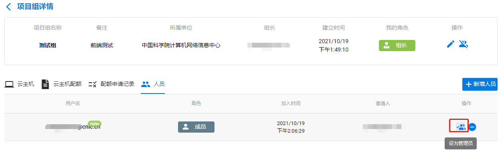   
点击按钮，取消成员“管理员”角色  
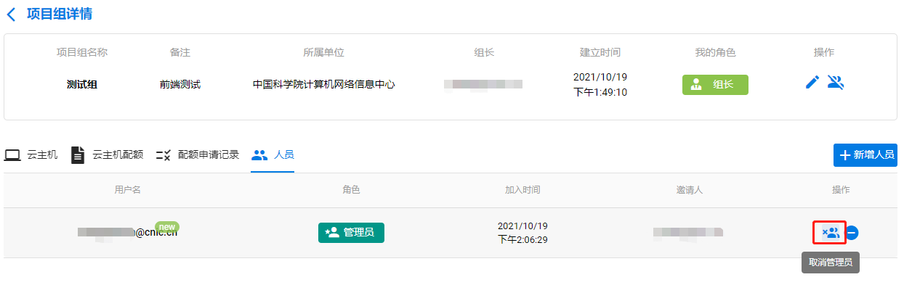   
### 3 将人员移除项目组
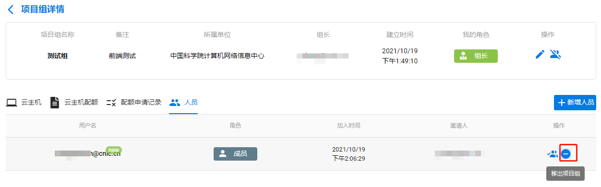   
