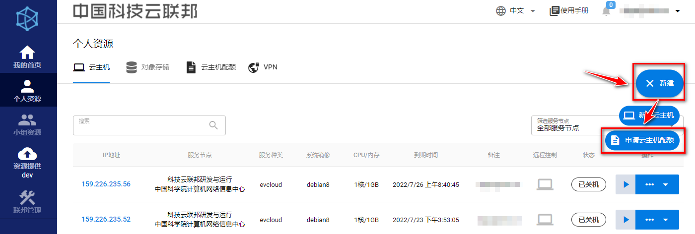
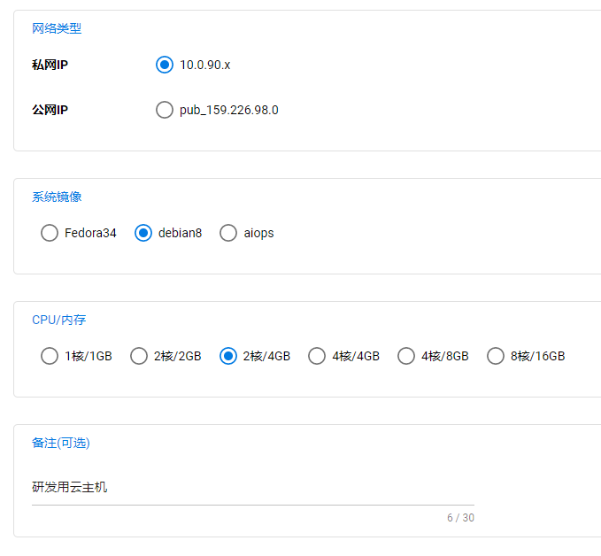
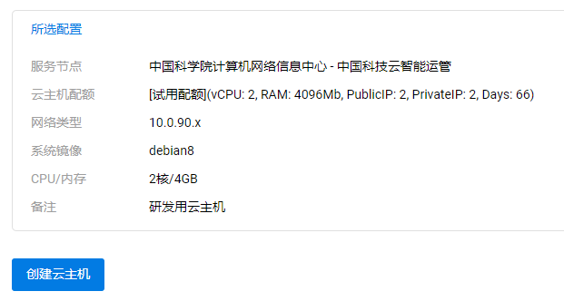
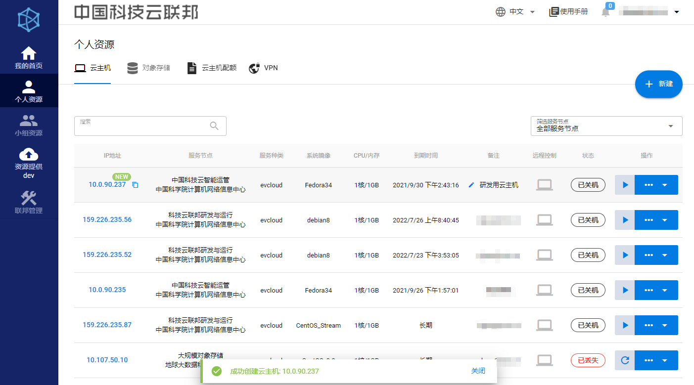
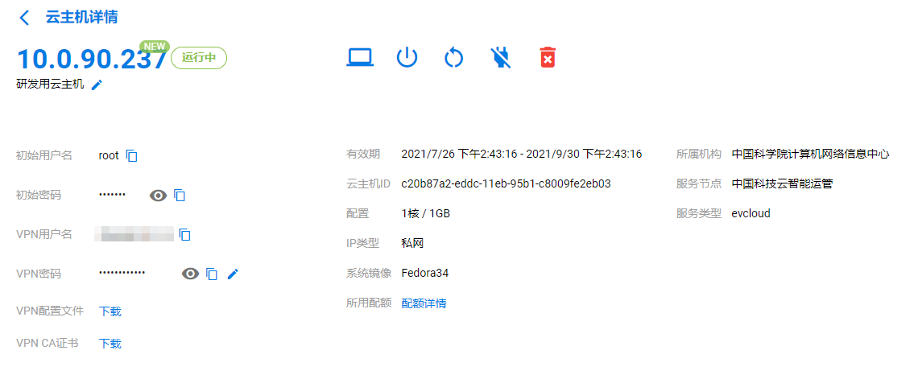

# 个人资源  
个人资源包括：云主机资源和对象存储资源。  
使用个人资源需要首先申请配额，再根据配额进行资源的创建、使用。

## 配额  
### 1 配额介绍  
配额用来控制资源的分配，由个人用户提出申请，再由服务节点的管理员审批。  

每一份云主机配额包含（如下图所示）：  

* 服务节点：配额与服务节点绑定。使用每个服务节点的云主机资源前，均需在该节点进行申请对应云主机配额。  
* 云主机时长：利用该配额创建的云主机的可用时长，从云主机创建起计算。  
* CPU/内存/私网IP/公网IP/云硬盘：该配额内资源的总额，用尽则配额失效。  
* 配额失效时间：该配额的最后可用时间，过期则配额失效。  
  

### 2 申请配额   
#### 2.1 进入云主机配额申请页面  
点击按钮，进入[云主机配额申请页面](https://fed.cstcloud.cn/my/personal/quota_apply)  
  
#### 2.2 选取目标服务节点  
  
#### 2.3 选择所需资源总额  

#### 2.4 填写备注  
  
#### 2.5 检查申请信息，并提交申请  
  
申请提交后，请等待服务节点的管理员审批。

## 云主机
利用相关配额，用户可在对应服务节点创建云主机资源。

### 1 创建云主机  
#### 1.1 进入新建云主机页面云主机
点击按钮，进入[新建云主机页面](https://fed.cstcloud.cn/my/personal/quota_apply)
  
#### 1.2 选择目标服务节点
  
#### 1.3 选择要使用的配额
  
#### 1.4 选择所需配置，并填写备注
   
#### 1.5 检查云主机信息，并创建云主机
   
#### 1.6 成功创建云主机后，页面将跳转到云主机列表页面。
  

### 2 使用云主机
#### 1.1 云主机详情
点击云主机IP地址，或云主机详情按钮，可进入云主机详情页面。  
该页面包含该云主机全部信息，例如：操作系统初始用户名、密码，VPN信息，配置信息等。  
也可在右上角对云主机进行操作。  
  
#### 1.2 云主机操作
* 开机：启动该云主机  
* 关机 ： 关闭该云主机  
* 重启 ： 重启该云主机  
* 断电 ： 对该云主机强制断电  
* 删除 ：删除该云主机  
* 强制删除：在删除云主机不起作用时，可强制删除该云主机  
#### 1.3 VNC远程控制
点击远程控制按钮，可在浏览器内对云主机进行远程控制  
#### 1.4 SSH连接
在[连接VPN](/manual/vpn)后，可使用xshell、bitvise等工具与云主机建立SSH连接。  
云主机操作系统的初始用户名和密码可在云主机详情页面内查询。  

## 对象存储
开发中...  