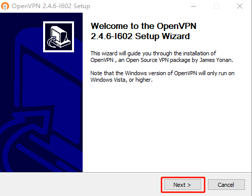
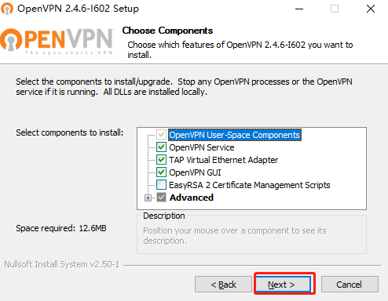
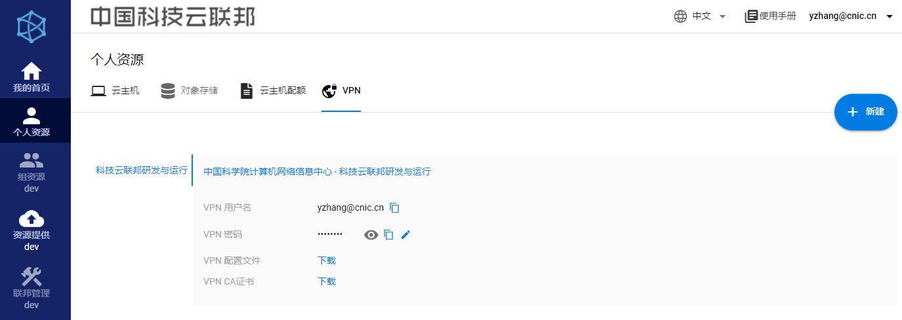
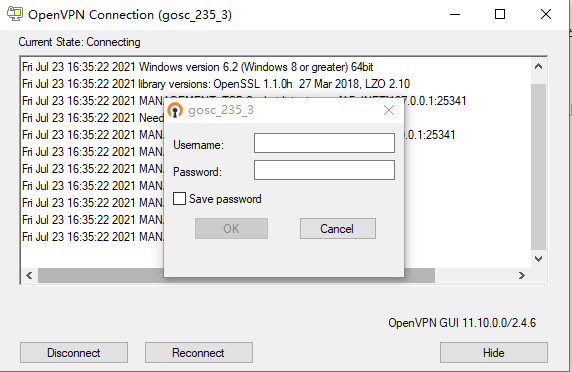

# VPN使用方法  
部分云主机所在服务节点需要连接VPN后，方可进行SSH连接。  

## Windows  
### 1 openVPN客户端   
#### 1.1 客户端下载
请点击链接[下载openVPN客户端](http://159.226.91.152/download/openvpn/openvpn-install-2.4.6-I602.exe)

#### 1.2 客户端安装  
* 点击【next】，进入下一步  

* 点击【I Agree】，进入下一步  

* 使用默认组件即可，点击【next】，进入下一步  

* 安装目录使用默认目录，无须修改，点击【Install】进行安装  

### 2 服务节点配置文件

* openVPN客户端安装完毕后，需要配置2个配置文件后，方可使用。  
分别是：  1. VPN节点配置文件  2. CA证书文件  
* 配置文件与服务节点对应，即：**同一个服务节点内的云主机，所使用的配置文件相同，只需配置一次即可。**  

####  2.1 配置文件下载   
* 下载位置如图5所示，点击【下载】即可；部分浏览器需要右键点击链接，选择“另存为文件”。  

#### 2.2 移动配置文件
* 将刚才下载的两个文件移动到配置文件保存路径。   
  openVPN的默认配置文件保存路径为：C:\Program Files\OpenVPN\config，如图6所示。（若在安装过程中修改了目录位置，则需自行找到对应路径）  
  

* 若在复制过程中遇到提示，需要提供管理员权限才能移动文件，直接点击【继续】  
  

### 3 启动VPN连接  

* 双击openVPN客户端图标，在任务栏右下角出现，表示客户端已启动。

* 右键点击，选择相应的配置，如“gosc_235_3”，点击【connect】

* 根据提示输入Username和Password，点击【ok】即可。勾选“Save password”，下次登录时，会记住密码，避免多次输入。**用户名和密码在配置文件下载页面可获得。**

* 连接成功后，任务栏右下角会出现 ，即表示VPN已连接。此时可对云主机进行SSH连接。

## macOS
待更新...
