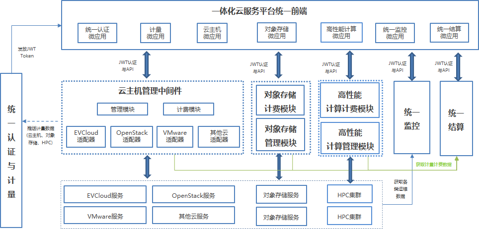

[//]: # (## 中国科技云-一体化云服务平台)
一体化云服务平台整合不同机构的分布式数据中心资源，提供统一认证、统一服务、统一计量、统一结算、统一监控的一体化云计算环境。基于全开源软件技术栈自主研发、构建，为用户提供云计算、对象存储等一体化云服务。

- **统一访问入口**：为用户提供同时在线使用云计算、对象存储资源的一体化可视云服务。
- **统一认证**：提供基于AAI的统一认证服务。
- **统一服务**：提供计算、存储等资源汇集的一站式解决方案。
- **统一计量结算**：提供统一的多维度多用户视角的资源使用量统计报表，以及基于科技云券的资源结算方式，全方位满足用户使用需求。
- **统一监控**：提供针对视频会议平台、主机集群、存储集群的统一监测平台，便于管理员随时查看集群健康状态。

## 特点

- **统一架构**：构建统一访问入口、统一认证、统一服务、统一计量结算、统一监控的高可用、可扩展一体云架构，全生命周期为用户提供可靠服务保证。
- **联邦运行模式**：基于科研活动特征建立联邦合作模式，资源提供者提供资源，科技云提供运维团队，实现资源汇聚与共享。
- **多项目支持**：1个国家重点研发项目，2个中科院级项目交叉支持。
- **自主研发**：自研EVCloud软件提供科研云主机服务，具有轻量级、快速部署、灵活配置的优点，已建立4个合作伙伴；自研iharbor提供对象存储服务，具有快速访问、高性能、高可用的优点，已建立2个合作伙伴。
- **开源社区**：建立“CSTCloud-CNIC”开源社区，拥有17个项目仓库，13名开发者，以及5名硕士生、博士生参与研发。
- **高效运维团队**：提供7×24小时高效稳定运维团队。

## 应用场景

一体化云服务平台支持大数据处理、人工智能、算法模型训练等应用场景，广泛应用于卫星遥感、新媒体、化学材料、声学信息处理等领域。

## 技术架构

一体化云服务平台整合不同机构的分布式数据中心资源，提供统一的用户认证、云资源注册、管理、发现、计量、监控与用户服务。

## 技术栈

前端：TypeScript，Vue.js，Single-SPA，Quasar，Pinia

后端：Python 3.9，Django 3.2

数据库：TiDB

## 开源地址

中间件管理软件：https://gitee.com/cstcloud-cnic/vms

EVCloud：https://gitee.com/cstcloud-cnic/evcloud

iharbor：https://gitee.com/cstcloud-cnic/iharbor  
