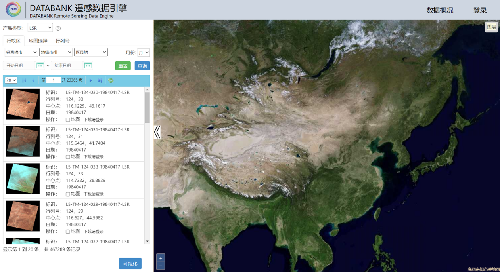
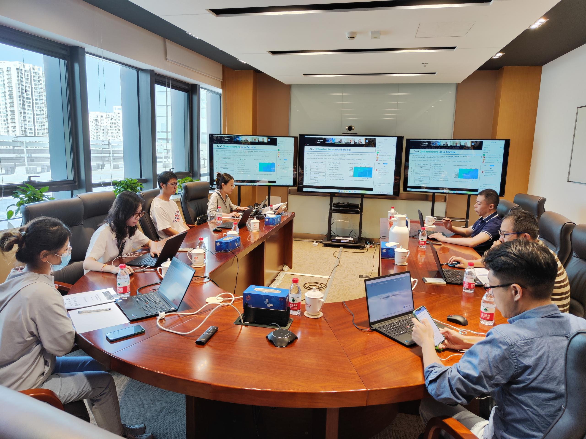
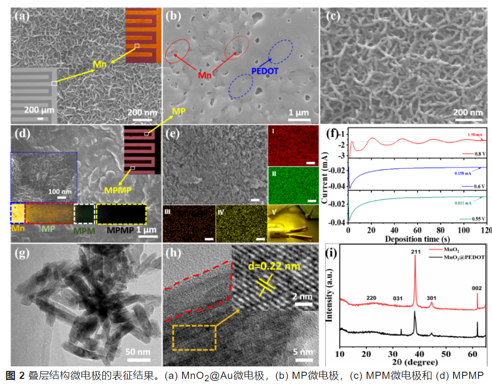
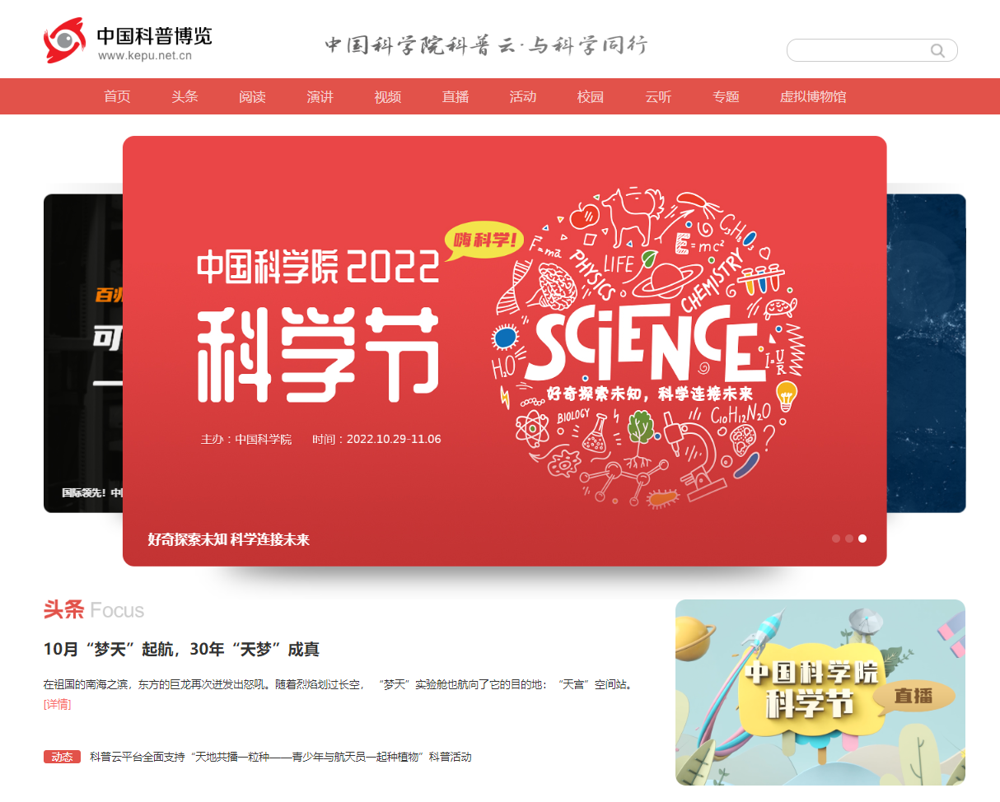
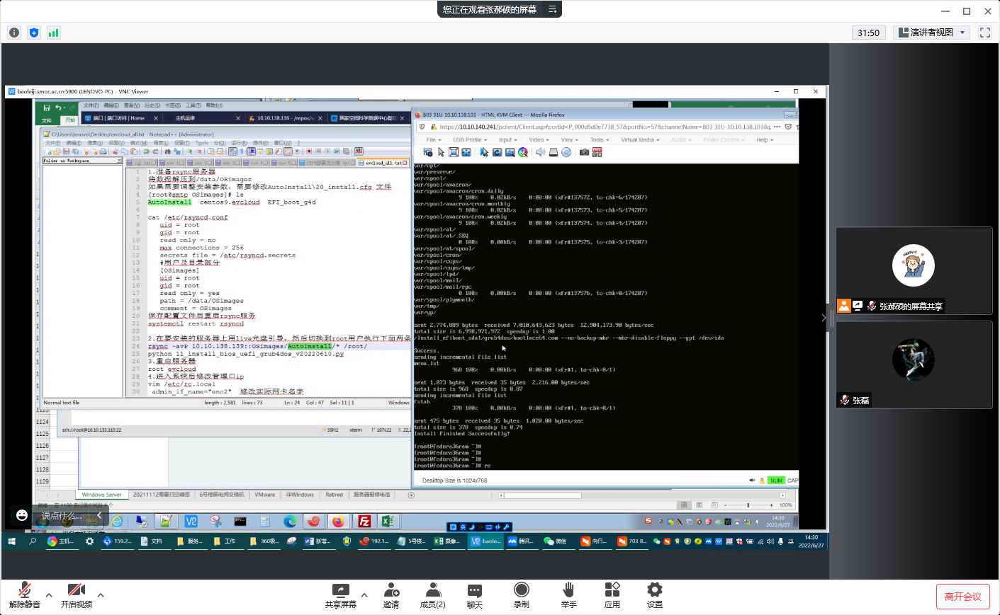

---

---

# 应用案例  

## PB级数据存储-CASEarth DataBank遥感数据引擎  

CASEarth DataBank是面向地球大数据科学工程建立的一套具有自主知识产权的数据、计算与服务一体化的时序对地观测数据智能服务平台，能够高效存取多源、多尺度、长时序的卫星影像及其他地球观测数据库中的资料，并提供足够的运算能力来对这些数据进行处理和分析。  

目前，DATABANK的遥感图像数据集均存储在iharbor中，涉及17个对象存储桶，存储数据量超过1.35PB，元数据约六千万条。iharbor支持遥感图像的高并发读写，DataBank网站以50GB/S的速度实时在线获取遥感图像数据，并进行可视化渲染。iharbor对象存储基于稳定的底层架构和高速接口服务于DataBank，进一步助力遥感卫星“大数据”向空间信息和地学知识高效转化，对促进人工智能与遥感信息处理等多学科交叉融合和科技创新具有重要意义。  

  

## 助力“全球开放科学云”项目国际培训  

2022年9月，一体化云服务平台为“2022 开放科学和可持续发展国际培训班”（2022 International Training Workshop on Open science and SDGs）提供技术支持和培训资源，共制作发放200张1200点资源券，用于购买云主机。培训内容包括：中国科技云一体云解决方案介绍、一体化云服务平台实操演示、对象存储介绍及4种数据访问方式实操演示。在线培训国际用户近百人，用户在线实时创建云主机数十台，培训效果显著。  

  

## EVCloud持续助力中科院化学所数篇高质量论文产出  

中科院化学所绿色印刷重点实验室聚焦国家和行业重大需求，针对微纳制造技术的“卡脖子”问题，提出发展纳米印刷微纳制造技术，并拓展了纳米印刷技术在印刷光子、印刷电子、3D打印等众多领域的应用，引领众多产业变革。在本领域取得了一系列具有国际影响力的研究成果，形成了特色的纳米印刷图案化和器件制备技术，并在Nature, Nat. Commun., Adv. Mater., Joule等国际期刊发表了数篇高质量论文。在文章中，作者对中国科技云云主机服务提供的计算能力给予感谢，高性能的云主机有力支撑了论文实验数据分析处理。EVCloud将持续助力科研成果的产出。  

论文列表：  
- Muhammad Tahir, Lihong Li*, Liang He*, Zhongyuan Xiang, Zeyu Ma, Waqas Ali Haider, Xiaoqiao Liao, Yanlin Song*. Interdigital MnO2/PEDOT Alternating Stacked Microelectrodes for High-Performance On-Chip Microsupercapacitor and Humidity Sensing. Energy Environ. Mater. 2022.  DOI: 10.1002/eem2.12546.  
- Gu, Z., Wang, Y., Wang, S. et al. Controllable printing of large-scale compact perovskite films for flexible photodetectors. Nano Res. 15, 1547–1553 (2022).  
- kong, W., Li, L., Yu, X. et al. Platinum nickel alloy-MXene catalyst with inverse opal structure for enhanced hydrogen evolution in both acidic and alkaline solutions. Nano Res. (2022).  
- Li, Lihong & Yu, Xiaoxia & Lin, Zhaoyang & Cai, Zhenren & Cao, Yawei & Kong, Wei & Xiang, Zhongyuan & Gu, Zhengkun & Xing, Xianran & Duan, Xiangfeng & Song, Yanlin. (2022). Interface Capture Effect Printing Atomic‐thick Two‐dimensional Semiconductor Thin Film. Advanced Materials. 2207392. 10.1002/adma.202207392.  

  

## 支持新媒体部内容数据海量存储、便捷访问与快速查询  

新媒体部承担院网络宣传、网络科普和继续教育等信息化平台建设、资源开发以及运行服务，支撑院国内国际科学传播和继续教育工作。中国科技云对象存储系统大力支持新媒体文化建设，提供视频、图片、文档等半/非结构化数据持久化存储，面向终端用户提供交互友好的对象存储FTP访问接口与综合查询接口，还提供了异地双备份功能保证存储数据安全。对象存储系统大大提高了数据读取、下载速度，为新媒体部持续稳定发表高水平、高质量的文章/视频奠定了夯实基础。  

  

## EVCloud有效支撑空间环境和航空航天领域的大数据处理  

轻量级、灵活配置、可扩展的EVCloud在计算资源统一管理方面具有优势。**国家空间科学中心**和**中国科学院微小卫星创新研究院**通过EVCloud便捷地完成近几十台服务器部署、使用，实现宿主机，云主机镜像、网络、硬盘的灵活配置。EVCloud的应用在计算资源自主管理运行、促成科研计算任务上云等方面有了自主性和新的探索。  

  

