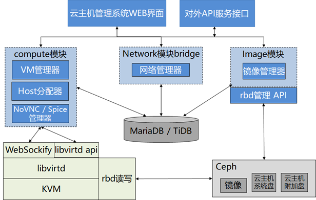
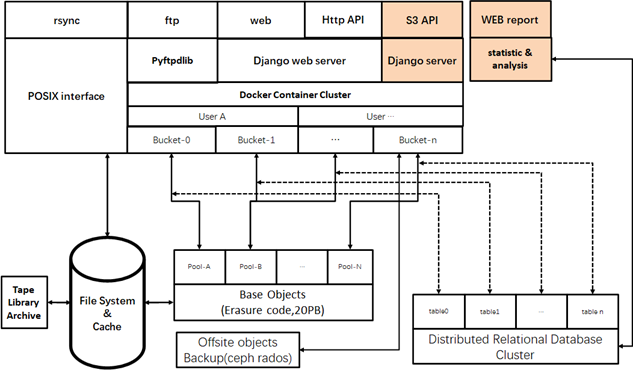
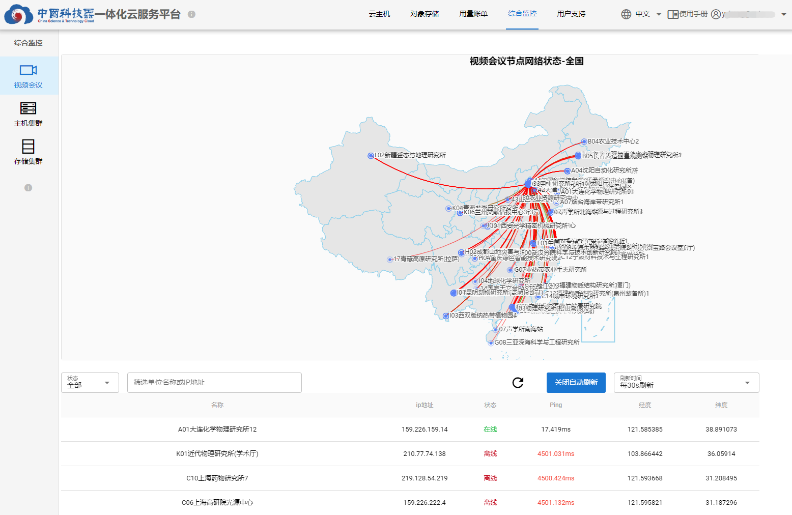
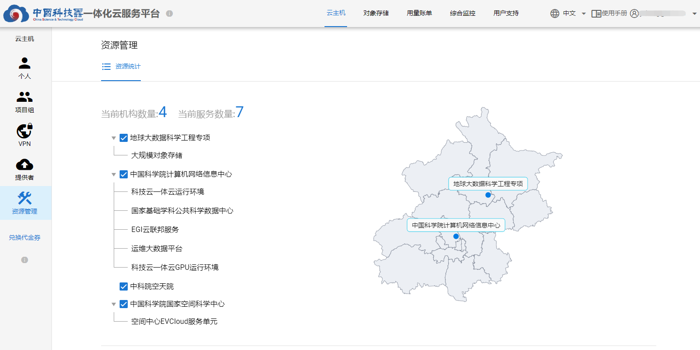

# 资源与服务  

## 科研云主机  

科研云主机是面向科研用户提供的一种基础设施服务，整合了计算、存储与网络资源，采用基于云计算模式的按需使用和按量付费。一体化云服务平台汇聚了EVCloud、OpenStack和VMware三种云资源管理软件，用户可以根据需要在不同服务单元迅速创建相应资源规格的科研云主机。  

优点：**轻量级、功能实用、维护简单、可个性化定制**  

开源地址：https://gitee.com/cstcloud-cnic/evcloud  

  

## 对象存储  

对象存储系统支持PB级非/半结构化数据的海量存储，底层基于纠删码技术构建稳定持久、高性能、高可用分布式存储服务，具有简单易用、安全、集约的优势。除了可以在本平台上传、下载、共享对象存储桶的数据，还可以通过HTTP RESTFul API、FTP协议、rclone客户端挂载到本地目录来访问对象数据，并提供数据异地备份功能。  

开源地址：https://gitee.com/cstcloud-cnic/iharbor  

  

## 云监控  

云监控采用“采集+汇聚+持久化存储”的解决方案，构建针对视频会议平台、主机集群、存储集群的统一监控，实时监测各集群的主机状态、集群状态、CPU使用率、内存使用率、磁盘使用率等。  

  

## 资源提供者  

**7**个科研云主机服务单元，分别来自机构（项目组）  
- 地球大数据科学工程专项  
- 中国科学院计算机网络信息中心  
- 中国科学院国家空间科学中心  

**2**个对象存储服务单元，分别来自机构（项目组）  
- 中国科学院计算机网络信息中心  
- 运维大数据平台  

  

## 服务能力  

- CPU：约8000核（含其他单位及项目）  
- 内存：17477.5 GB  
- 对象存储：25PB  
