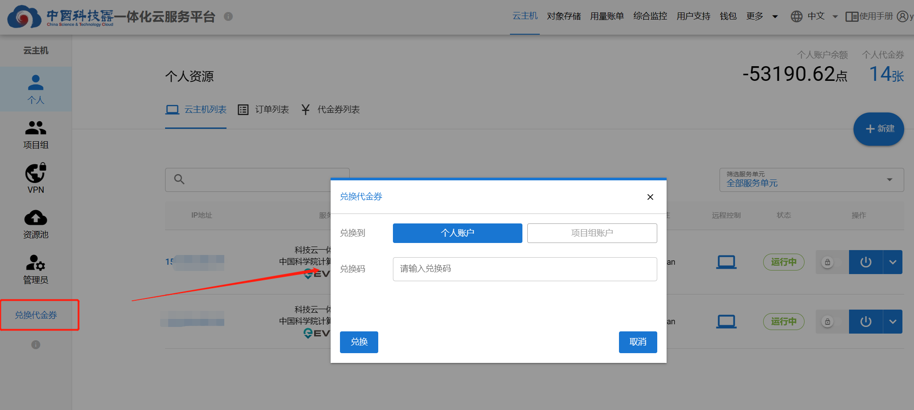
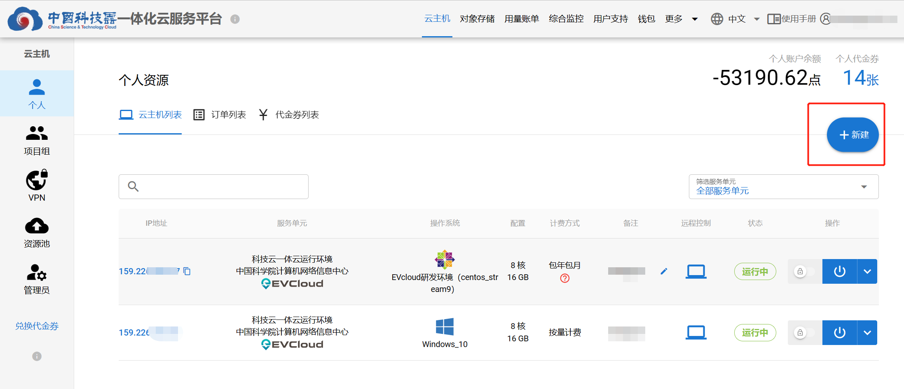
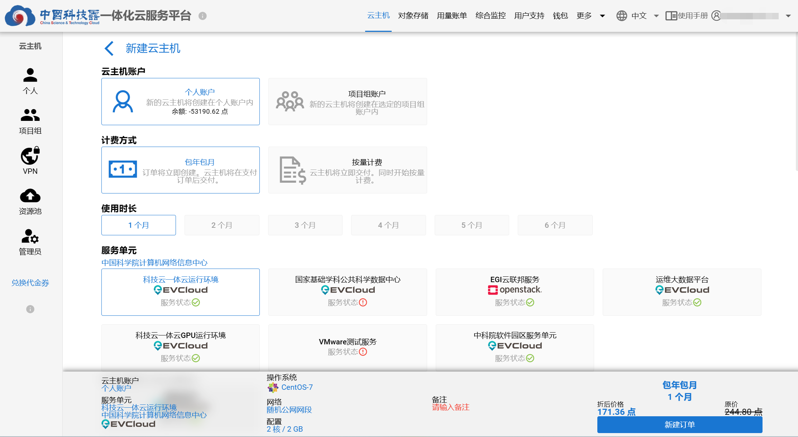
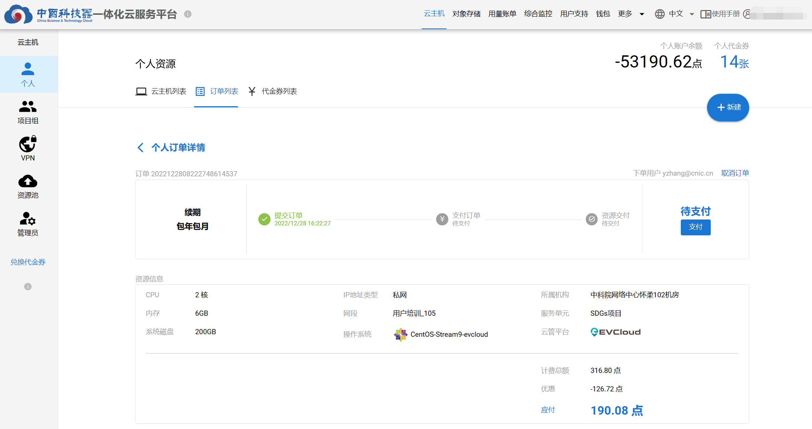
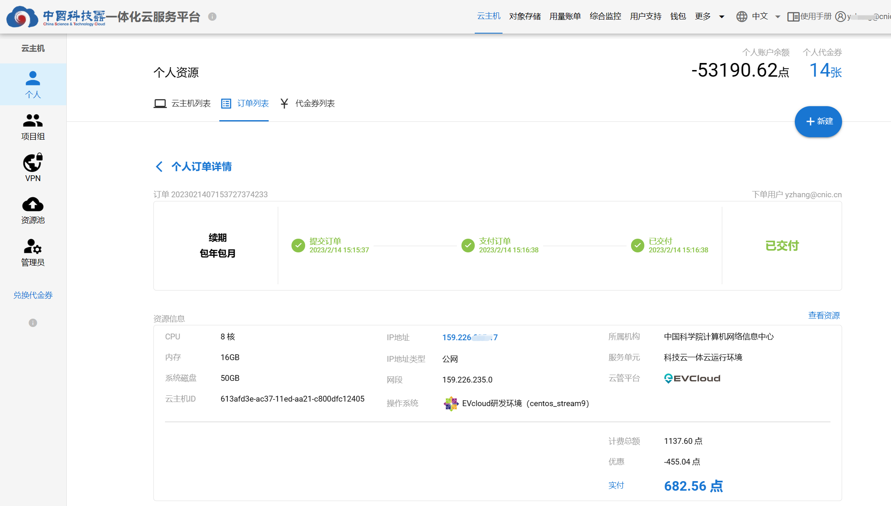
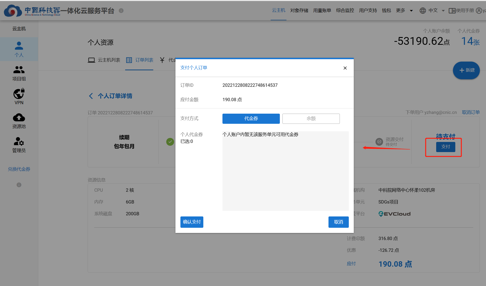
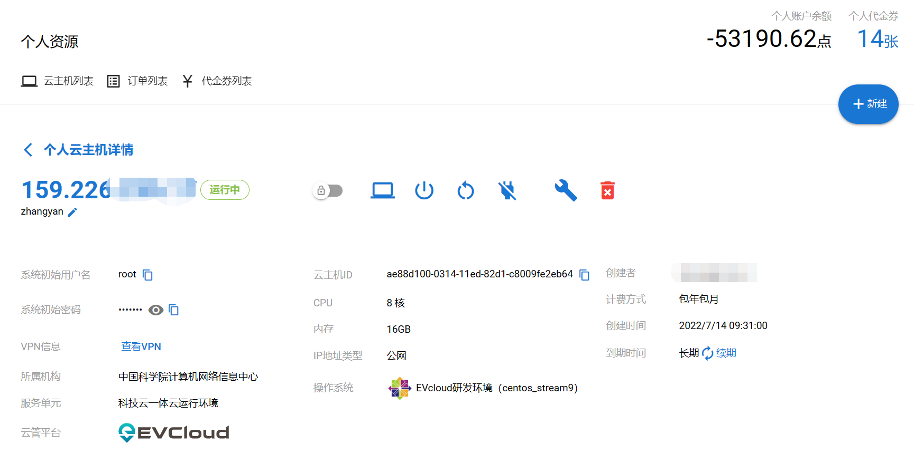

# 个人云主机管理   

## 代金券兑换
点击【兑换代金券】按钮，选择“个人账户”，输入兑换码，点击【兑换】按钮。跳转到”代金券“页面，完成个人代金券兑换。    
 

## 云主机创建 
代金券兑换至个人账户后，可以使用代金券在相应服务单元创建云主机。
### 1 新建云主机  
点击【新建】按钮，进入[云主机新建页面](https://service.cstcloud.cn/my/server/deploy)   
   

### 2 选择云主机的配置 
选择云主机账户、云主机计费方式、使用时长、服务单元、操作系统、网络、云主机配置，并填写备注，点击【新建订单】。  
   
### 3 订单
在“订单”页面可以查看预订购云主机的资源以及将要支付的金额，还可以取消订单。  
选择**包年包月**计费方式的，需支付订单后，云主机资源才会交付。  
   
选择**按量计费**计费方式的，新建订单后，云主机资源直接交付。之后，按照使用量进行每日按量扣费。  
  
### 4 支付订单
点击【支付】按钮，进行订单支付。可以使用“代金券”和“余额”两种方式进行支付。    
代金券与服务单元绑定，需先确保有该服务单元的代金券，两张代金券可以合并支付。  
   
确认支付后，系统将直接交付对应资源。    

## 云主机使用  
点击云主机IP地址，进入云主机详情页面。 该页面包含该云主机全部信息，例如：操作系统初始用户名、初始密码，VPN信息，配置信息，创建/到期时间，计费方式等。以及一些云主机操作按钮和云主机续期按钮。    
   
### 云主机操作
* 开机：启动该云主机  
* 关机：关闭该云主机  
* 重启：重启该云主机  
* 强制断电： 对该云主机强制断电  
* 删除：删除该云主机   
* 锁定：被锁定的云主机，不能进行开机、关机、重启、断电、删除和强制删除等操作，仅能查看组云主机详情、使用VNC、进行SSH连接  
* 云主机续期：针对”包年包月“的云主机，到期后进行续费继续使用  
* 重建云主机：通过该操作可以更换当前云主机的操作系统，在不用重新付费的情况下保持原云主机的配置不变。但是，**重建云主机会丢失全部数据，且无法恢复**，请谨慎操作。
* VNC远程控制：点击远程控制按钮，可在浏览器内对云主机进行远程控制
* SSH连接：在[连接VPN](../vpn)后，可使用xshell、bitvise等工具与云主机建立SSH连接  
