# 项目组资源 

* 项目组：是云主机资源、人员、项目组代金券的整合，组内云主机资源由所有人员共享，组内有明确的权限划分。 
## 项目组使用  
###  1 新建项目组  
点击按钮，进入[新建项目组页面](https://fed.cstcloud.cn/my/group/create)   
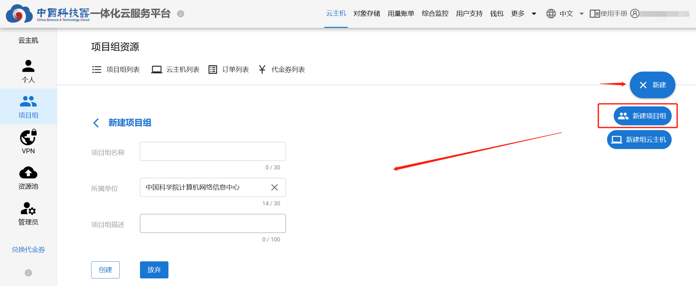   
输入项目组名称、描述，并确认所属单位信息，点击“创建”按钮，新建项目组  
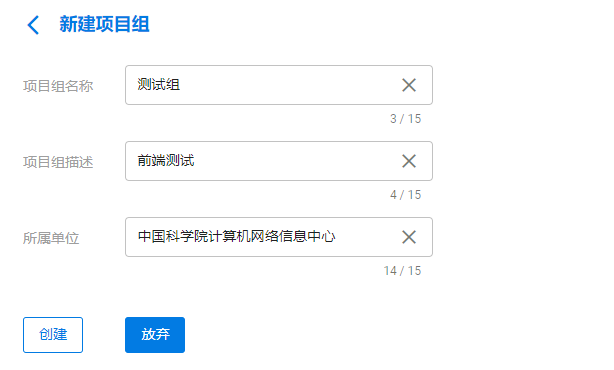   
成功创建项目组后，页面将跳转到项目组列表页面   
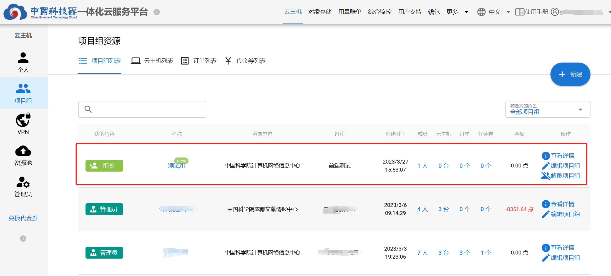   
### 2 项目组详情   
点击项目组名称或查看详情按钮，跳转至项目组详情页面，展示与该项目组有关的云主机资源、成员、订单、代金券信息  
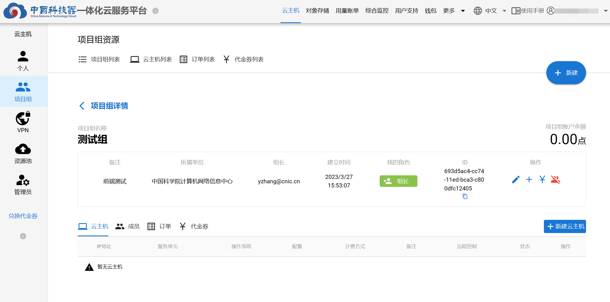   
### 3 项目组账户余额  
项目组有单独账户，与用户个人账户不同。初始账户余额为0，账户余额通过充值产生。  
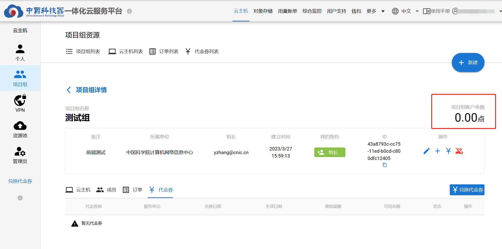   
### 4 项目组代金券  
项目组有单独代金券列表，用于为项目组创建组内共享的云主机。  
点击【兑换代金券】按钮，选择“项目组账户”，选择想要兑换代金券的项目组，输入兑换码，点击【兑换】按钮。  
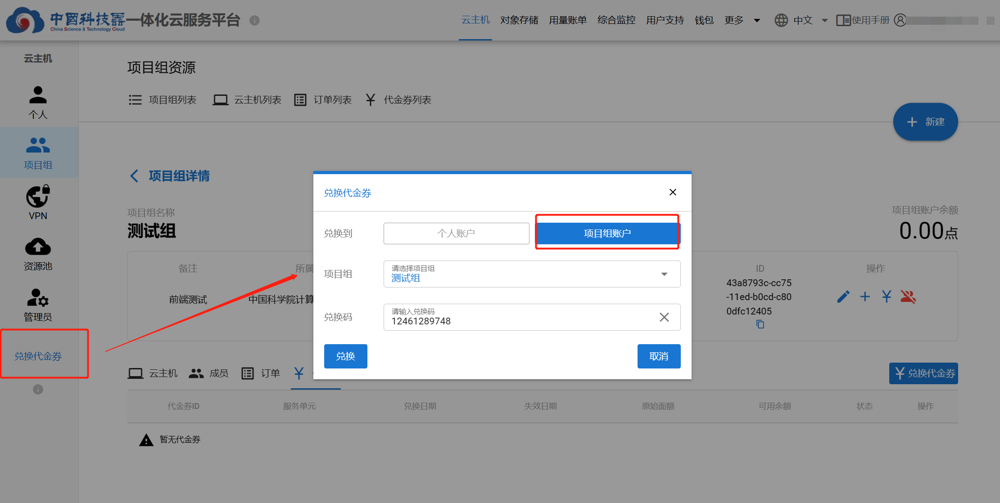   
可以在项目组详情的“代金券”页面看到新兑换的代金券。  
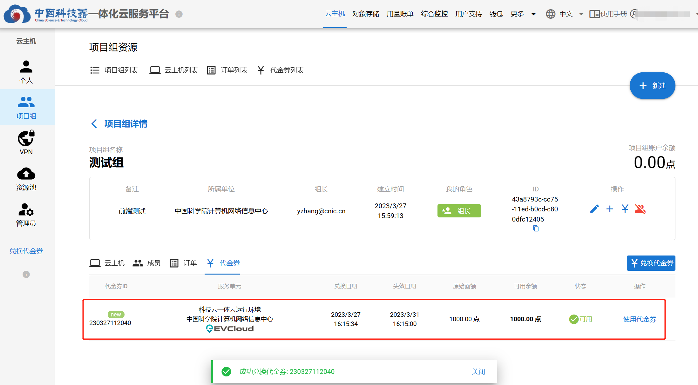  
### 5 解散项目组  
解散项目组需保证组内云主机、代金券、订单记录、人员等均被删除或移除，组长才能解散项目组。  
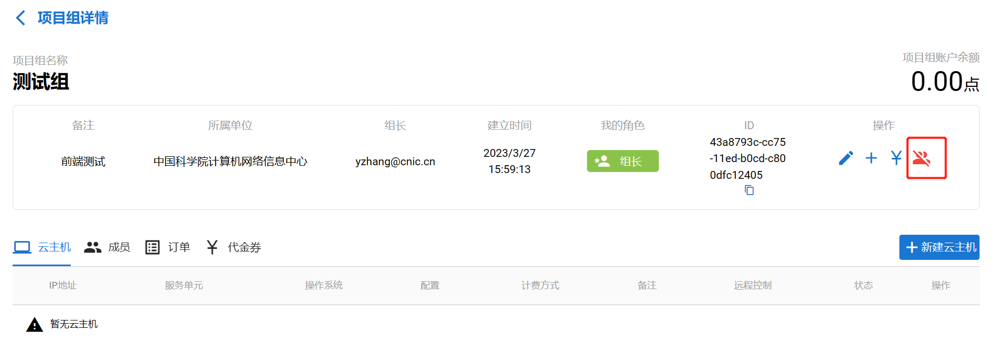    
 

### 组云主机  
项目组代金券兑换后，组长和管理员可以使用代金券在相应服务单元创建云主机  
### 1 创建组云主机  
#### 1.1 进入新建组云主机页面  
点击按钮，进入[组云主机新建页面](https://service.cstcloud.cn/my/server/deploy?isgroup=true)   
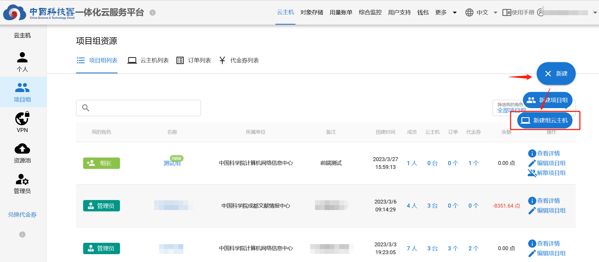   

或者  

先进入**项目组详情页面**，再点击“新建云主机”按钮，进入“组云主机新建页面”  
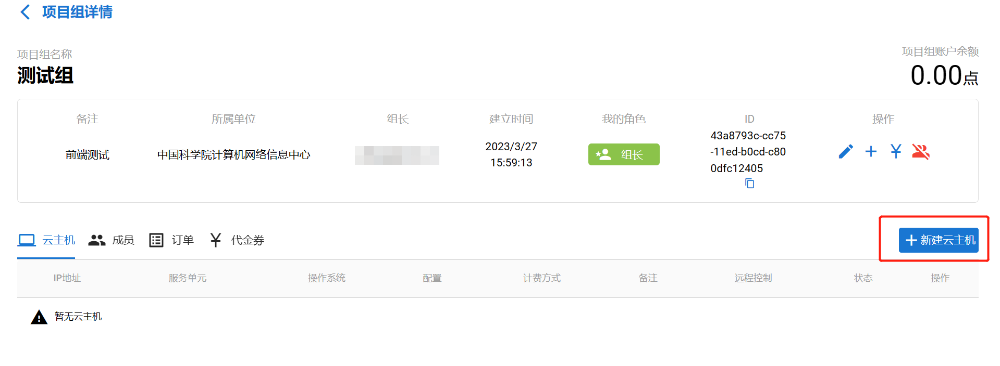   
#### 1.2 选择云主机的配置 
选择想要创建云主机的项目组、计费方式、使用时长、服务单元、操作系统、网络、云主机配置，并填写备注，点击【新建订单】。  
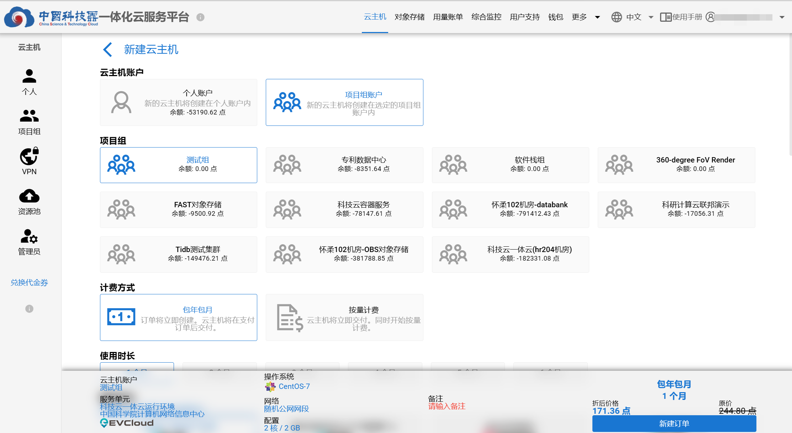   
#### 1.3 订单
在“订单”页面可以查看预订购云主机的资源以及将要支付的金额，还可以取消订单。  
选择**包年包月**计费方式的，需支付订单后，云主机资源才会交付。  
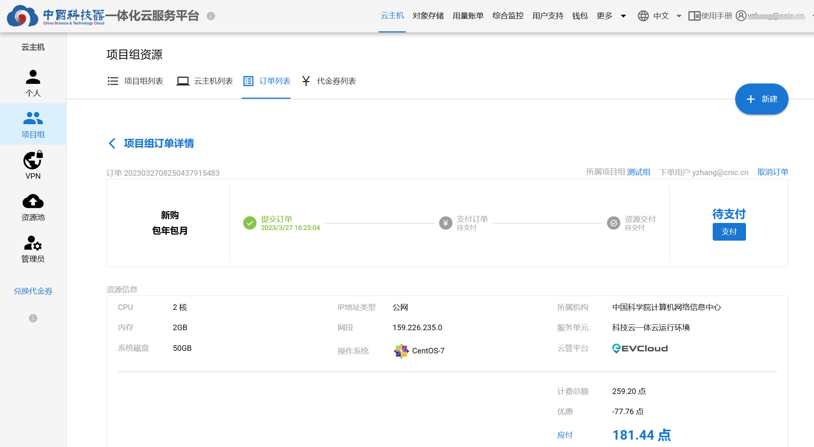   
选择**按量计费**计费方式的，新建订单后，云主机资源直接交付。之后，按照使用量进行每日按量扣费。  
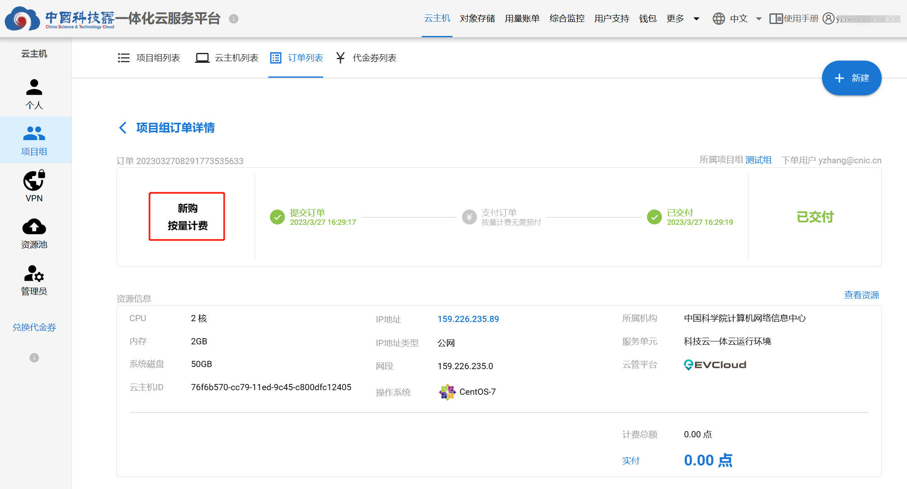  
#### 1.4 支付订单
点击【支付】按钮，进行订单支付。可以使用项目组“代金券”和“余额”两种方式进行支付。    
代金券与服务单元绑定，需先确保有该服务单元的代金券，两张代金券可以合并支付。  
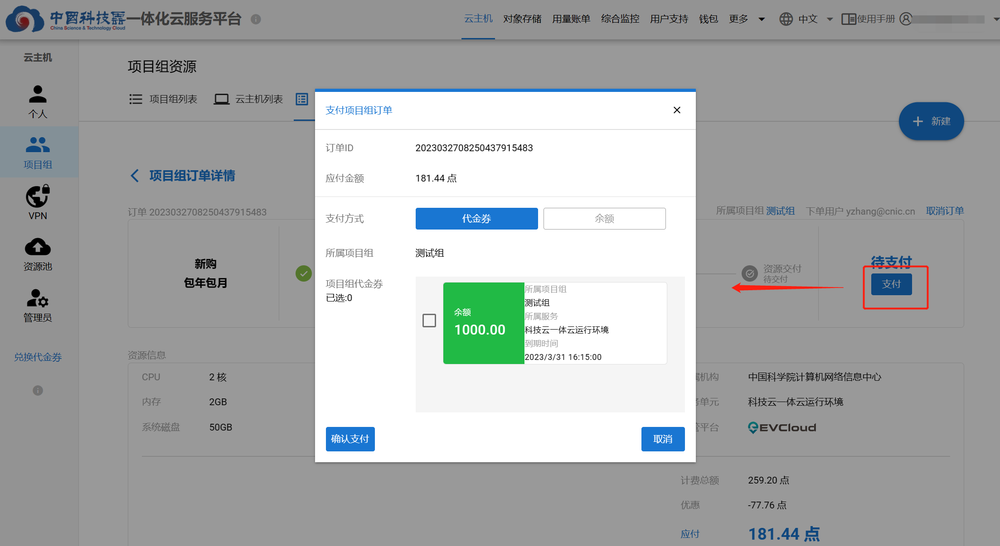   
确认支付后，系统将直接交付对应资源。    
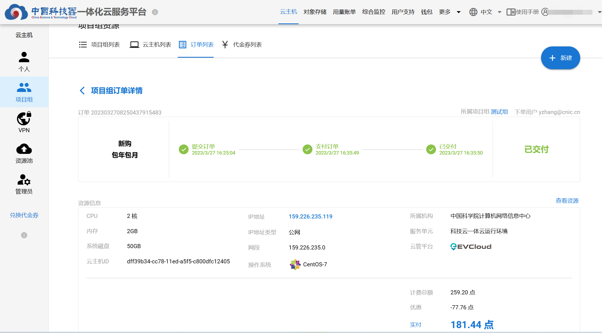 

### 2 使用组云主机  
点击云主机IP地址，进入云主机详情页面。  
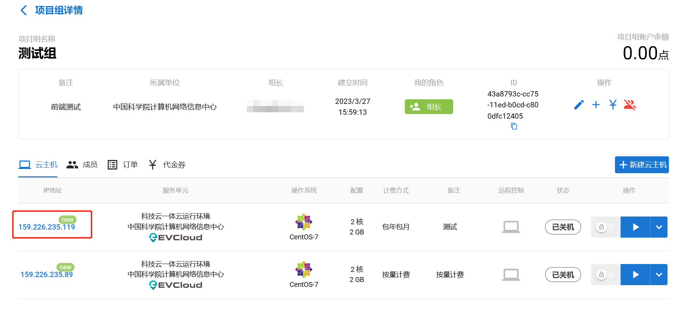 
该页面包含该云主机全部信息，例如：操作系统初始用户名、初始密码，VPN信息，配置信息，创建/到期时间，计费方式等。以及一些云主机操作按钮和云主机续期按钮。  
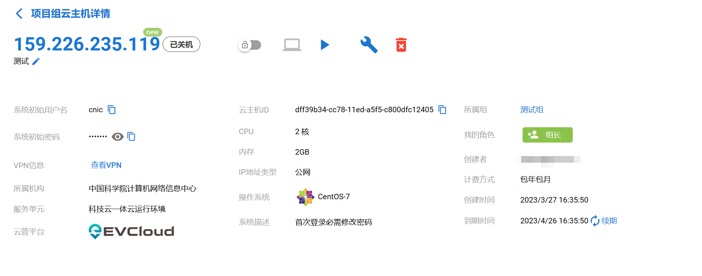  
#### 云主机操作
* 开机：启动该云主机  
* 关机：关闭该云主机  
* 重启：重启该云主机  
* 强制断电： 对该云主机强制断电  
* 删除：删除该云主机   
* 锁定：被锁定的云主机，不能进行开机、关机、重启、断电、删除和强制删除等操作，仅能查看组云主机详情、使用VNC、进行SSH连接  
* 云主机续期：针对”包年包月“的云主机，到期后进行续费继续使用  
* 重建云主机：通过该操作可以更换当前云主机的操作系统，在不用重新付费的情况下保持原云主机的配置不变。但是，重建云主机会丢失全部数据，且无法恢复。
* VNC远程控制：点击远程控制按钮，可在浏览器内对云主机进行远程控制
* SSH连接：在[连接VPN](../vpn)后，可使用xshell、bitvise等工具与云主机建立SSH连接

## 项目组角色与权限  
### 1 组长  
每个项目组只有1名组长，为该组的创建人  

组长权限：   

*  管理组员：添加成员，通过添加科技云通行证账户或发送邀请链接（暂未上线）的方式；移除成员，被移除的成员不再享用项目组内的任何资源；查看所有组员的资源使用情况  
*  分配角色：为成员赋予管理员的角色，或取消其管理员的角色  
*  使用资源：使用云主机资源。如：兑换云主机代金券；创建云主机；使用组内任何成员创建的云主机  
*  管理资源：管理云主机资源  
*  删除项目组：需先删除项目组内所有云主机、代金券、订单记录、人员等  
*  组长权限移交（暂未上线）   

### 2 管理员  
每个组允许有多个管理员，只有组长能够赋予成员“管理员”的角色  

管理员权限：   

*  管理组员：添加成员，通过科技云通行证账户或发送链接（暂未上线）的方式；移除成员，被移除的成员不再享用项目组内的任何资源；查看所有组员的资源使用情况  
*  使用资源：使用云主机资源。如：兑换代金券；创建云主机；使用组内任何成员创建的云主机  
*  管理资源：管理云主机资源   
### 3 组员  
每个组的成员数量不作限制，不具备管理权限  

组员权限：  

*  使用资源：使用云主机资源。如：使用组内任何成员创建的云主机  
## 项目组成员管理  
### 1 新增人员  
先进入**项目组详情页面**，再点击“新增成员”按钮，添加成员。在“增加人员页面”，输入正确的“科技云通行证”邀请成员进入项目组，可输入多个。    
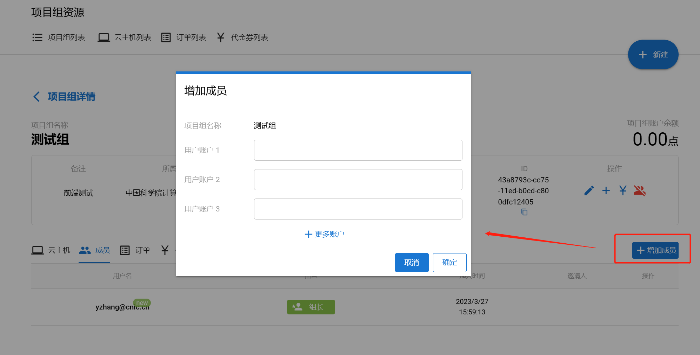   
 

### 2 赋予/取消管理员权限  
点击按钮，将组内成员设为“管理员”角色，或取消“管理员”角色。  
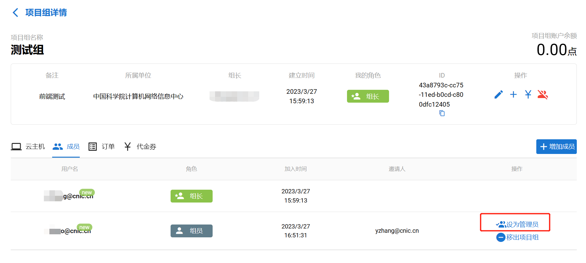   
### 3 将人员移除项目组
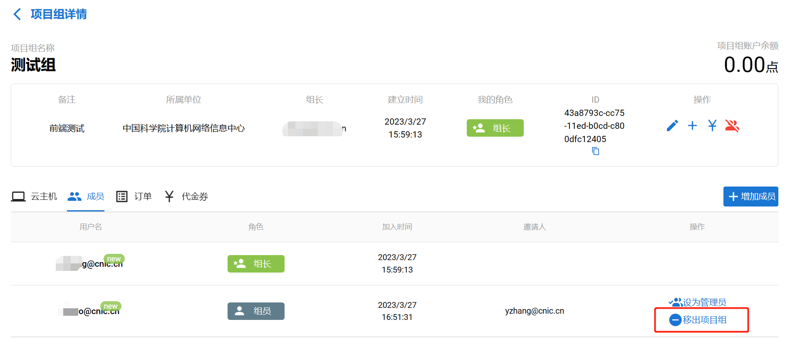   
