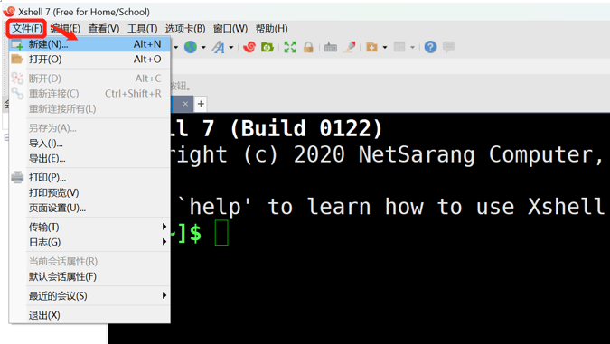
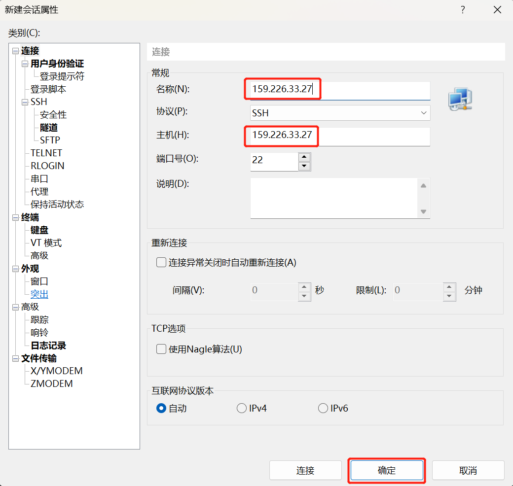
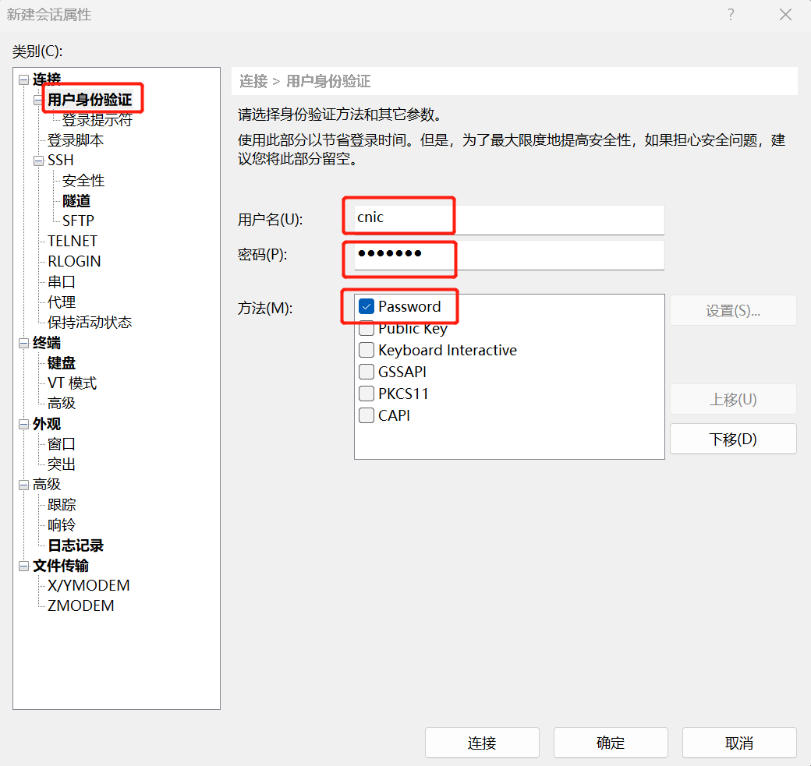
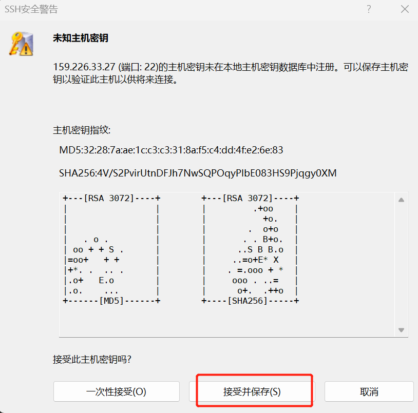
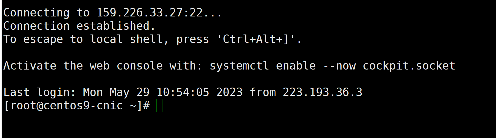
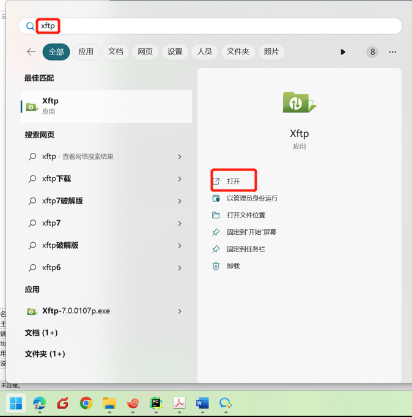
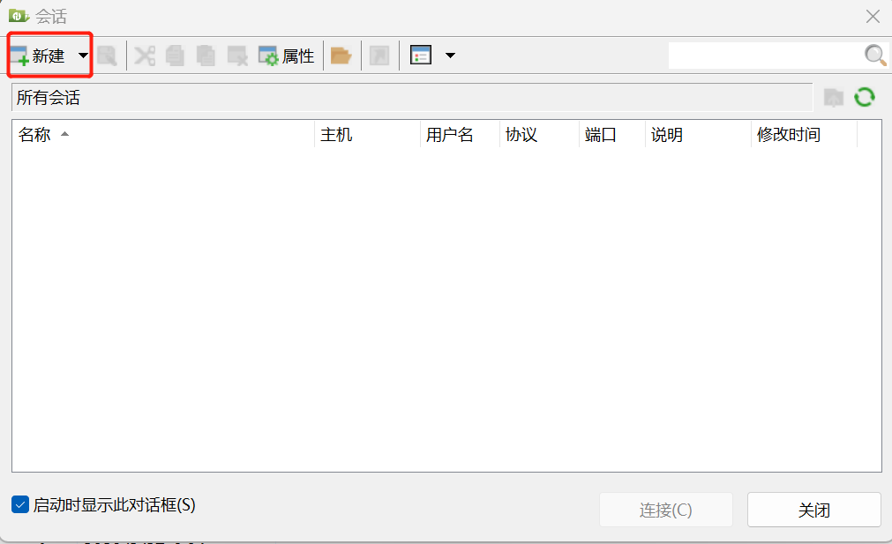
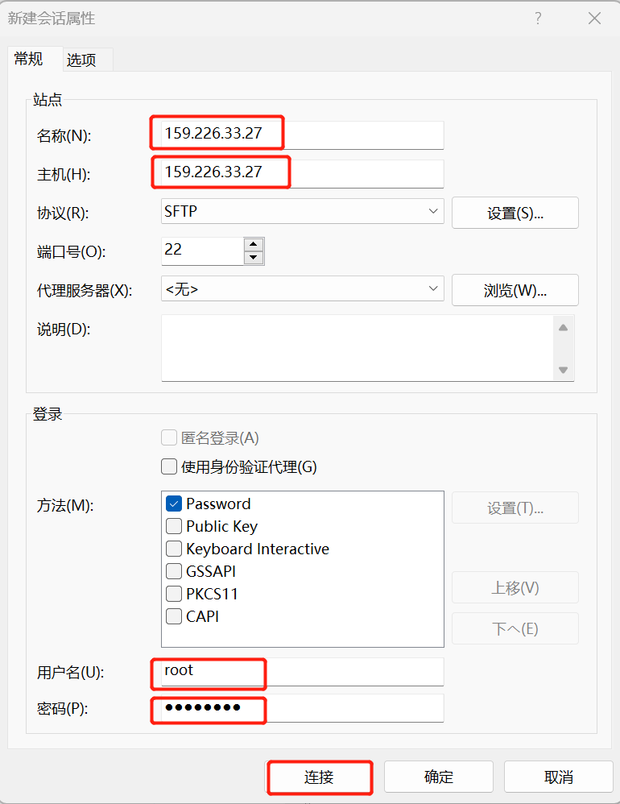
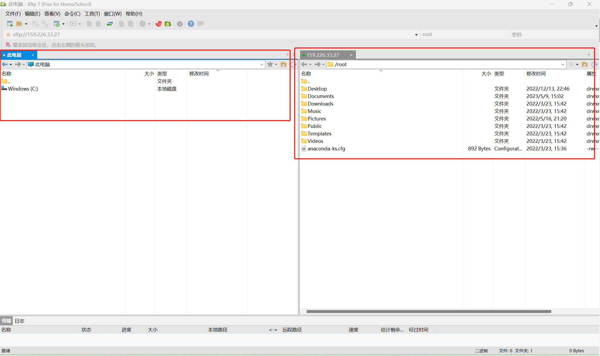

# 访问Linux云主机    

## 常用工具下载  

shell工具：  
* [xshell](https://www.xshell.com/zh/)   
* [MobaXterm](https://mobaxterm.mobatek.net/download.html)
* [PuTTY](https://www.putty.be/latest.html)

VNC远程工具：  
* [VNC Viewer](https://www.realvnc.com/en/connect/download/viewer/)  

SFTP、FTP文件传输软件：
* [xftp](https://www.xshell.com/zh/)   
* [winSCP](https://winscp.net/eng/download.php)

## ssh远程访问（以xshell为例）   

1. 在访问Linux云主机前，需先完成[openVPN客户端的安装与配置](../vpn)，同时确保vpn是连接状态，即任务栏右下角出现 。
2. 安装xshell工具，进入xshell界面。    
2. 点击【文件】-【新建】，或点击新建远程会话按钮，配置相关信息。  
   
3. 在弹出的对话框中，在**连接**信息部分，输入会话名称、主机，会话名称可以根据需求填写，主机即为您的云主机IP地址。      
  
4. 接着，点击**用户身份验证**，配置云主机登录账户信息，输入**用户名**和**密码**，相关信息可在云主机详情页面查看；验证方法勾选“Password”；最后，点击“连接”按钮。  
 
5. 如遇到下图所示对话框，点击“接受并保存”。  
 
6. 然后就可以远程连接到云主机。  
 

## 通过VNC Viewer远程访问  
1. **在云主机自行配置、启动VNC服务。**  
2. 在本机安装客户端VNC Viewer客户端。
3. 远程访问云主机桌面。  

## linux云主机与本地文件互传（以xftp为例） 
1. 在进行linux云主机与本地文件互传时，需先完成[openVPN客户端的安装与配置](../vpn)，同时确保vpn是连接状态，即任务栏右下角出现 。    
2. 安装xftp工具。  
3. 在“开始”菜单，搜索xftp，点击打开xftp客户端。  
  
3. 在弹出的对话框中，点击“**新建**”按钮。    
   
4. 在“新建会话属性”对话框中，填写将要进行文件传输的云主机的相关信息。输入**名称**、**主机**、**用户名**、**密码**，接着，点击“连接”按钮。  
 
5. 即可建立本地与云主机之间的文件传输通道。如下图所示，左侧为本地目录，右侧为远程目录。   

6. 若您已经在xshell客户端完成了与云主机的shell连接，那么在上方菜单栏点击 按钮直接打开xftp客户端，即可直接建立与云主机的ftp文件连接。    
 