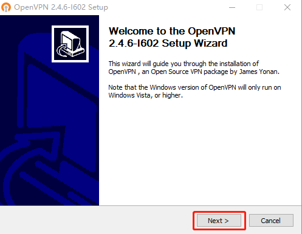
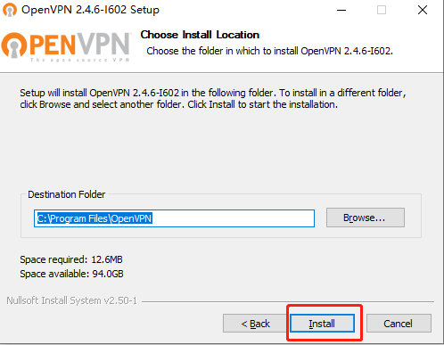
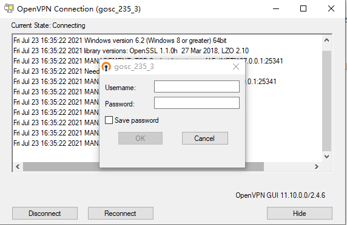

# VPN使用方法  
部分云主机所在服务单元需要连接VPN后，方可进行SSH连接。  

## Windows  
### 1 openVPN客户端   
#### 1.1 客户端下载
请点击链接[下载openVPN客户端](https://obs.cstcloud.cn/share/obs/cstcloud/OpenVPN-2.5.4-I604-amd64.msi)

#### 1.2 客户端安装  
* 点击【next】，进入下一步  

* 点击【I Agree】，进入下一步  

* 使用默认组件即可，点击【next】，进入下一步  

* 安装目录使用默认目录，无须修改，点击【Install】进行安装  

### 2 服务单元配置文件

* openVPN客户端安装完毕后，需配置相应节点的VPN配置文件，方可使用。  
* 配置文件与服务单元对应，即：**同一个服务单元内的云主机，所使用的配置文件相同，只需配置一次即可。**  

####  2.1 配置文件下载   
* 下载位置如图5所示，点击【下载】即可；部分浏览器需要右键点击链接，选择“另存为文件”。  

#### 2.2 移动配置文件
* 将刚才下载的VPN配置文件移动到配置文件保存路径。   
  openVPN的默认配置文件保存路径为：C:\Program Files\OpenVPN\config（若在安装过程中修改了目录位置，则需自行找到对应路径）  

* 若在复制过程中遇到提示，需要提供管理员权限才能移动文件，直接点击【继续】  
  

### 3 启动VPN连接  

* 双击openVPN客户端图标，在任务栏右下角出现，表示客户端已启动。

* 右键点击，选择相应的配置，如“gosc_235_3”，点击【connect】

* 根据提示输入Username和Password，点击【ok】即可。勾选“Save password”，下次登录时，会记住密码，避免多次输入。**用户名和密码在配置文件下载页面可获得。**

* 连接成功后，任务栏右下角会出现 ，即表示VPN已连接。此时可对云主机进行SSH连接。

## Linux
以centos 9 stream操作系统为例
### 1 命令行安装openvpn

yum -y install epel-release  
yum -y install openvpn

### 2 服务单元配置文件
 
* 配置文件与服务单元对应，即：**同一个服务单元内的云主机，所使用的配置文件相同，只需配置一次即可。**    

####  2.1 配置文件下载   
* 下载位置如图所示，点击【下载】即可；部分浏览器需要右键点击链接，选择“另存为文件”。  

#### 2.2 移动配置文件
* 将刚才下载的VPN配置文件移动到配置文件保存路径。   
  Linux操作系统下openVPN的默认配置文件保存路径为：/etc/openvpn/client（若在安装过程中修改了目录位置，则需自行找到对应路径） 

### 3 连接vpn
输入连接命令（openvpn --daemon --cd /etc/openvpn/client --config gosc_33.3.ovpn --log-append /var/log/openvpn.log --auth-user-pass），根据提示输入对应的账户和vpn密码（[查看vpn信息](https://service.cstcloud.cn/my/server/vpn)）。    

参数解释：  
* --daemon：后台运行
* --cd：配置文件目录路径
* --config：配置文件名称
* --log-append：日志文件
* --auth-user-pass：对应服务单元vpn的账户和密码

注意：可以同时起多个进程连接不同的vpn，但是同一个vpn不能有多个进程同时启用。  

### 4 验证  
使用命令（tail -f /var/log/openvpn.log）查看日志，出现以下提示则表示vpn连接成功。  

### 5 断开vpn连接
使用命令（ps -e | grep openvpn）查找openvpn的进程号；使用命令（kill -9 进程号）结束进程。  

## macOS
### 1 服务单元配置文件

* 首先，下载VPN客户端运行所需的VPN配置文件。  
* 配置文件与服务单元对应，即：**同一个服务单元内的云主机，所使用的配置文件相同，只需配置一次即可。**  

####  1.1 配置文件下载   
* 下载位置如下图所示，点击【下载】即可。 

#### 1.2 移动配置文件
* 将VPN配置文件放入同一文件夹中，例如以下位置：/Applications/OpenVPN Connect
（安装目录可自定义）

* 若在复制过程中遇到提示，需要提供管理员权限才能移动文件，直接点击【Authenticate】。

* 在弹出页面输入用户名和密码，点击【Ok】即可。

### 2 下载Tunnelblick，启动VPN连接 
#### 2.1 Tunnelblick客户端下载
请点击链接[下载Tunnelblick客户端](https://tunnelblick.net/release/Latest_Tunnelblick_Stable.dmg)

#### 2.2 Tunnelblick客户端安装及配置

* 点击下载的文件会弹出如下图所示的页面。

* 按照页面上的指示进行安装，安装完成后会出现配置configuration files的提示信息，按照需求进行操作。

* 或左键双击屏幕右上角出现Tunnelblick客户端图标，弹出configuration files配置页面，手动将之前下载的VPN节点配置文件直接拖入左侧的【Configurations】菜单栏中，在弹出页面中选择【Only Me】。

* 配置完成后的页面如下图所示。

* 若出现关于Tunnelblick版本的警告，直接点击【Ok】即可。

* 然后左键单击右上角的Tunnelblick客户端图标，选择Connect选项。

* 输入用户名和密码，【Security code】项可暂时忽略不填。
（用户名和密码可在配置文件的下载页面获得）

* 若出现如下图所示的提示或警告，可直接点击【Ok】跳过。

* 连接成功后，任务栏右上角的Tunnelblick客户端图标会变为深色，右键单击该图标会出现表示连接状态的页面。此时表示VPN已连接，可对云主机进行SSH连接。

