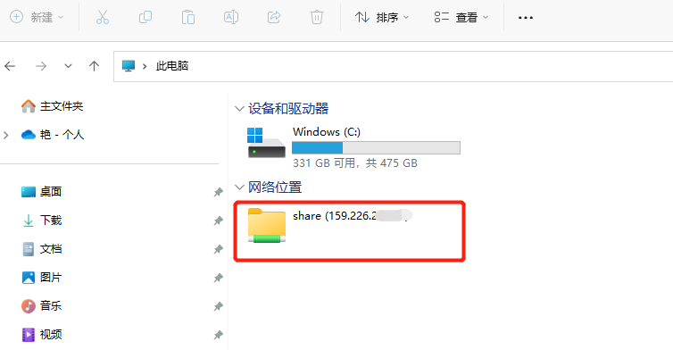

# 访问Windows云主机    

## 远程桌面访问

1. 在访问Windows云主机前，需先完成[openVPN客户端的安装与配置](../vpn)，同时保证vpn是连接状态，即任务栏右下角出现 。
2. 通过本机自带的远程桌面完成云主机的连接，点击本机的“**开始**”菜单，输入“**远程桌面**”，在右侧搜索结果中点击“打开”。  
      

3. 在弹出的对话框中，在**计算机**输入云主机IP地址，点击“连接”按钮。   
     

4. 接着，输入用户名和密码，初始用户名和密码在**云主机详情**页面查看；  
勾选“记住我的凭证”，方便下次连接；  
最后，点击“确定”按钮。  
    

5. 如遇到下图所示内容，直接勾选“不再询问我是否连接到此计算机”，再点击“是”按钮。  
    

6. 接着，您能看到正在等待远程连接云主机。  
    

7. 最后，进入如下页面，表示已经远程登录云主机。  
    

   通过点击屏幕上方的 ，可以关闭远程桌面窗口。  
   通过点击屏幕上方的 ，可以将远程桌面窗口最小化到任务栏，显示为。  
   通过点击屏幕上方的，可以将远程桌面窗口变大或变小。

8. 当您再次访问云主机时，由于已经完成账号配置并记住了账户信息，只需点击“连接”按钮，即可远程登录云主机。  

## windows云主机与本地文件互传

* **直接复制粘贴**：通过远程桌面连接到云主机，本机与云主机之间能直接粘贴复制文件。  
* **共享文件夹** （以windows 11为例）  
  1. 打开我的电脑，在空白区域单击右键，弹出菜单，选择**添加一个网络位置**。  
  
  2. 在弹出的对话框，点击**下一步**。
  
  3. 双击“选择自定义网络位置”。  
  
  4. 在**Internet地址或网络地址**位置，输入“**\\云主机IP地址\share**”，如图所示，然后点击**下一步**。  
  
  5. 在弹出的对话框中，点击“更多选项”，选择“使用其他账户”。再输入云主机的**用户名**和**密码**，并勾选“记住我的凭据”，点击“确定“。  
    
  6. 点击“下一步”。  
    
  7. 点击“完成”。  
    
  8. 此时已经成功链接到远程云主机的共享文件夹（c:\share\）。此时云主机与本地电脑均可以读取、存储此共享文件夹内的文件。  
   