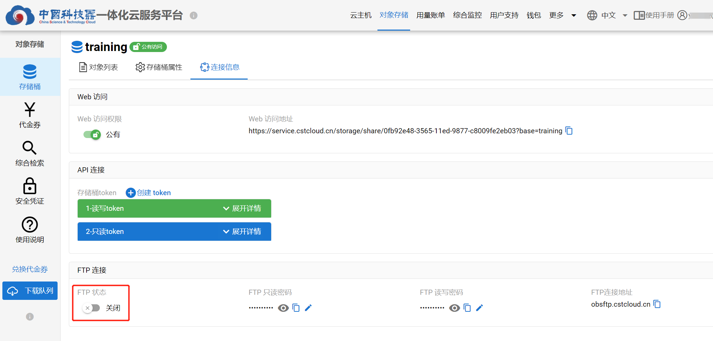
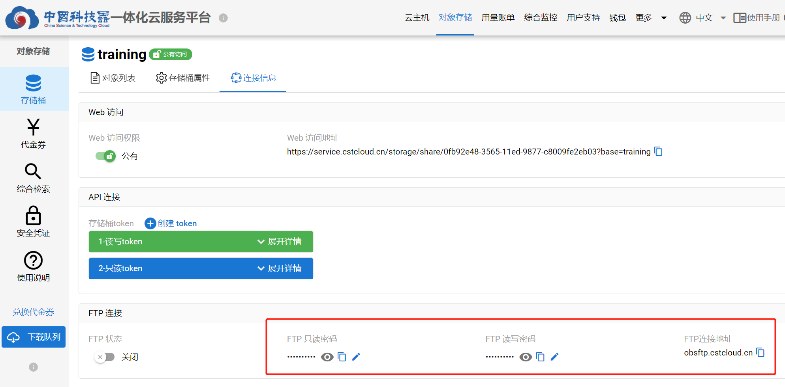

# ftp访问方式

## 使用方法
1. 下载并安装客户端   
   **图形页面** FileZilla:[点击下载](https://www.filezilla.cn/download)  
   **命令行** LFTP:[点击下载](https://lftp.yar.ru/get.html)
2. 开启存储桶ftp访问权限  
   使用ftp访问方式，必须保持FTP状态为”**开启**“   
   
4. 连接ftp服务器上传下载文件  
   - ftp连接地址是**存储桶所在服务单元的连接地址**  
   - ftp用户名是**存储桶名**  
   - ftp密码包括**只读、读写密码**，可在存储桶的**连接信息**页面查看  
   

## ftp服务器连接信息

1. “中国科技云对象存储服务”服务单元  
   连接地址： obsftp.cstcloud.cn  
   用户名：存储桶名  
   密码：在存储桶的连接信息页面查看只读/读写密码  
2. “运维大数据平台对象存储”服务单元  
   暂不提供

## 其他说明
- 被动模式下返回字符使用utf8编码；主动模式为了兼容windows网络映射，返回字符使用gbk编码。  
- 使用网络映射的方式挂载FTP（由于防火墙等限制，建议申请科技云windows主机进行挂载）
- 由于开启ftps加密传输，不建议使用FlashFXP

