# web页面使用

## 功能简介

一体化云服务平台对象存储页面提供了所有有关对象存储桶及其访问方式、认证方式等重要信息。  
- ”存储桶“页面：列表展示本账号下所有服务单元的存储桶，点击某个存储桶能够查看有关该存储桶的所有文件、属性信息和连接信息
- ”代金券“页面：查看所有兑换的代金券
- ”综合检索“页面：提供针对本账号下所有服务单元、所有存储桶的全域模糊查询
- ”安全凭证“页面：可查看本账户下所有服务单元的安全访问凭证信息，包括：身份认证Token、访问密钥对
- ”兑换代金券“按钮：提供对象存储代金券兑换功能，成功兑换的代金券可在”代金券“页面查看
- “下载队列”按钮：展示web页面文件下载进度

## web页面管理与使用对象存储桶

### 兑换代金券  
进入对象存储模块，点击【兑换代金券】按钮，输入兑换码，点击【兑换】。兑换成功后，自动跳转至”代金券“页面查看该代金券。
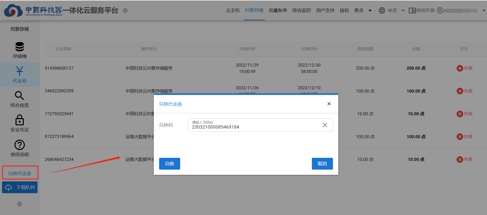

### 新建存储桶
点击【新建存储桶】，选择“服务单元”，输入符合命名规则“存储桶名称”，点击【创建】。
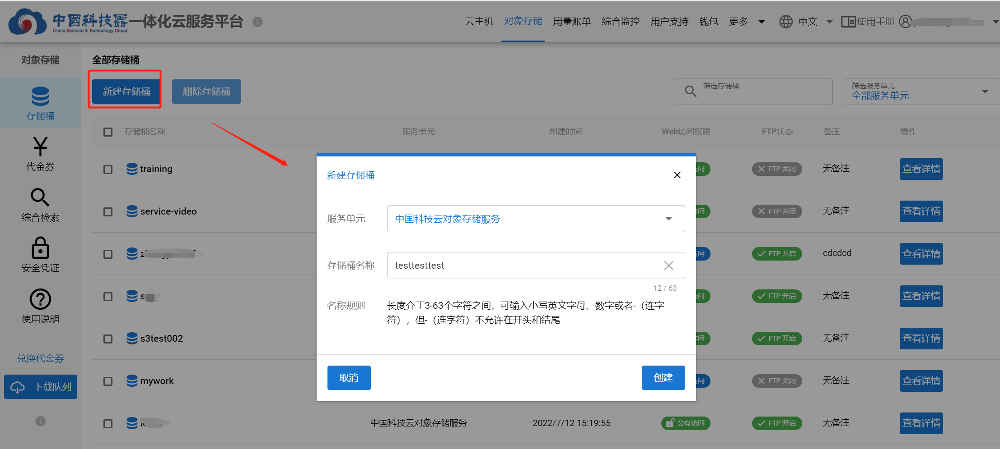
**注意：** 该服务单元存在有效的对象存储代金券，且金额大于100点时才能创建存储桶。

### 删除存储桶
选择要删除的存储桶，点击【删除存储桶】，确认信息，勾选“我了解删除存储桶将会导致其内部文件丢失”，点击【删除】。  
**注意：**删除后的存储桶不可恢复，请谨慎操作。
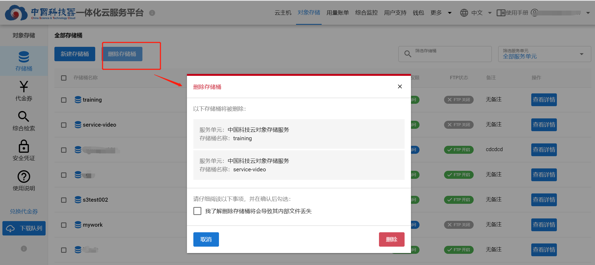

### 存储桶对象列表
点击存储桶名称或【查看详情】按钮，进入该存储桶的详情页面。**本页面的所有信息只与该存储桶相关。**
在“对象列表”页面，可以创建文件夹、上传文件、删除文件、重命名文件、下载文件、查看文件详情。
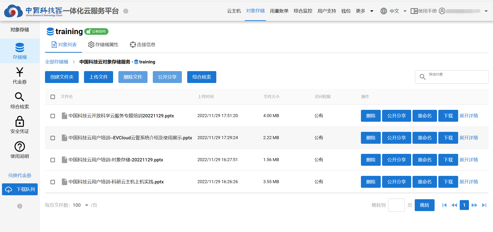

### 公开共享
通过点击【公开共享】按钮，可以单独或批量分享文件夹、文件。  
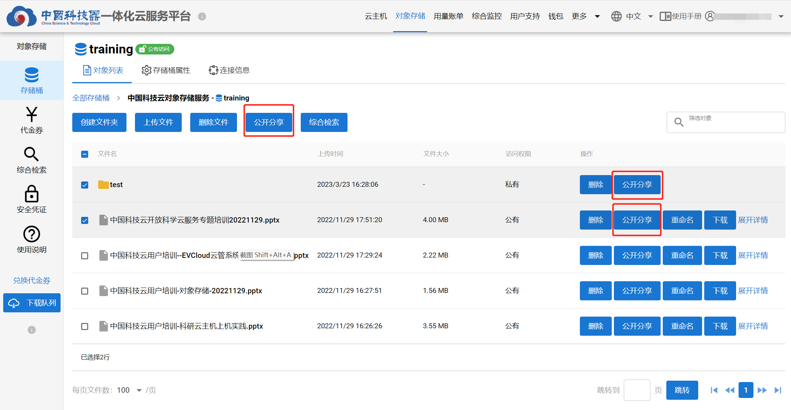
在弹出的对话框中，选择分享时长（私有、1天、7天、30天、永久公开），勾选是否有分享密码保护，点击【分享】。
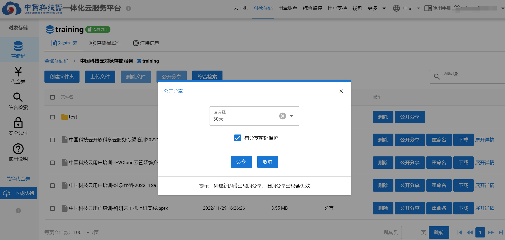
接着，能够获得本次分享的”分享链接“和”分享密码“。还可以点击【修改共享状态】再次修改。
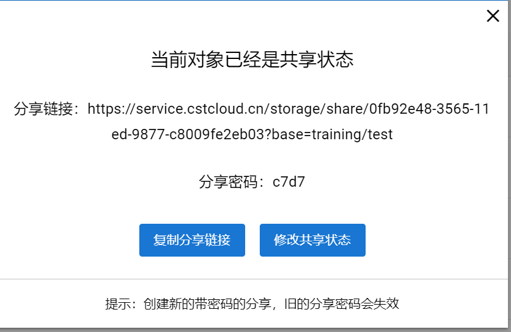

### 下载队列
对象存储目前支持单独下载某个文件，或通过点击【下载】按钮加入”下载队列“实现批量下载。
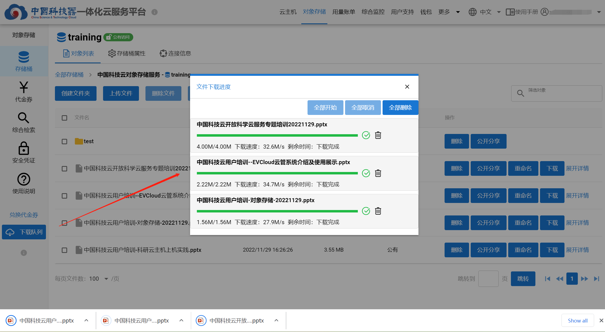

### 存储桶属性信息
点击存储桶名称或【查看详情】按钮，再点击【存储桶属性】，进入属性页面。  
该页面提供了存储桶创建时间、存储桶容量、对象数量等信息，还支持修改存储桶备注。
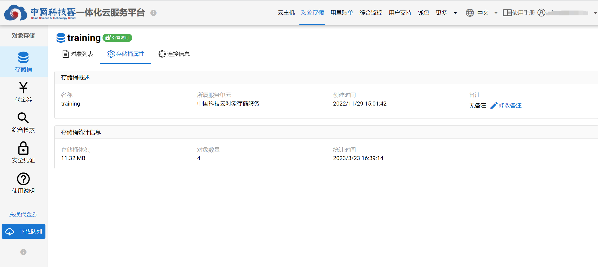

### 存储桶web访问权限设置
点击存储桶名称或【查看详情】按钮，再点击【连接信息】，进入连接信息页面。  
可以设置存储桶为”公有“或“私有”访问权限。  
- 公有：对全网开放该存储桶，通过web访问链接即可访问。
- 私有：不对全网开放，只有该存储桶所有者能够访问。
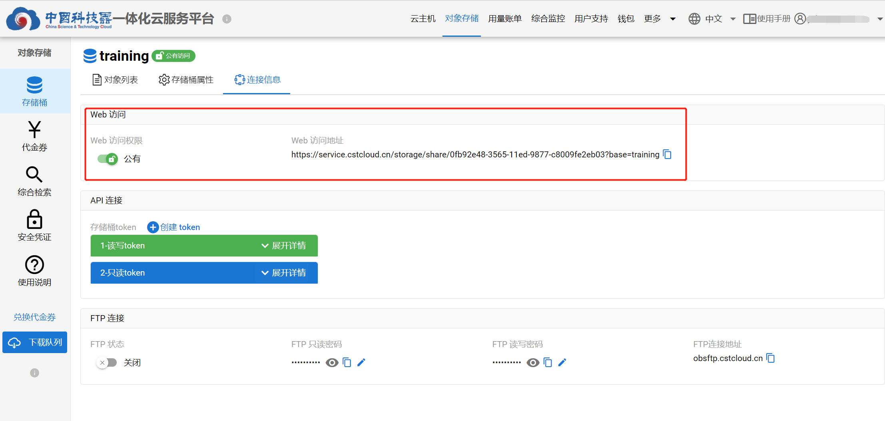

### 综合检索
针对本账号下所有服务单元、所有存储桶的全域模糊查询，并分别列出检索结果。  
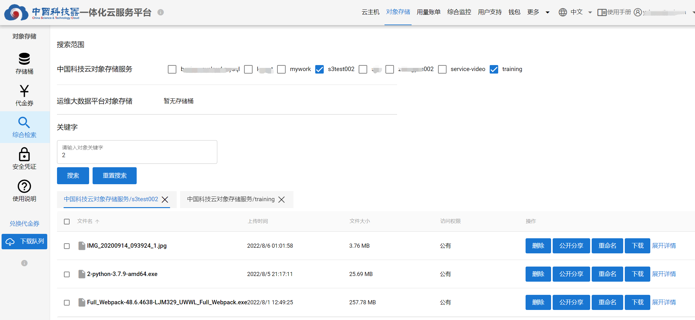

## web页面管理ftp访问相关信息
点击存储桶名称或【查看详情】按钮，再点击【连接信息】，进入连接信息页面。  
在“FTP连接”部分，能够开启“FTP状态”，修改FTP只读、读写密码，获取该存储桶的FTP连接地址。  

## web页面管理HTTP API访问凭证
访问凭证是在HTTP API调用时用于身份认证的关键信息，要妥善保存，并在泄露后第一时间登录web页面修改。  
### 账户安全凭证
该安全凭证针对个人账户，分为身份认证Token和访问密钥对，使用该凭证信息能够访问本账户下所有存储桶。  
要注意不同服务单元的安全凭证不同。
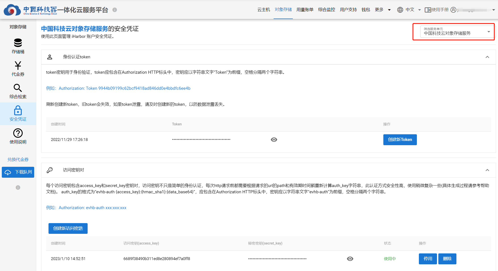
### 存储桶Token
点击存储桶名称或【查看详情】按钮，再点击【连接信息】，进入连接信息页面。  
在“API连接”部分可以创建、删除存储桶只读、读写Token。使用该凭证信息能够访问该存储桶，实现了单桶读写分离。 
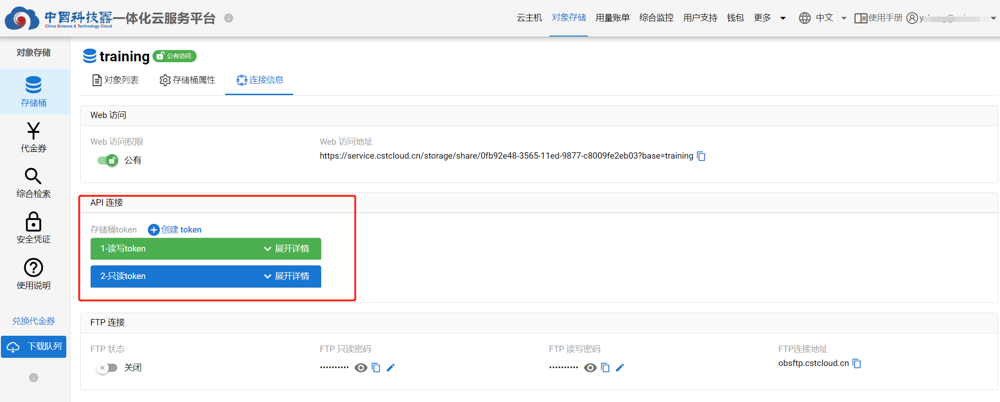